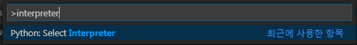
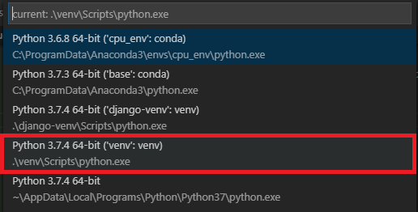
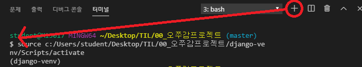
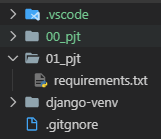
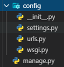
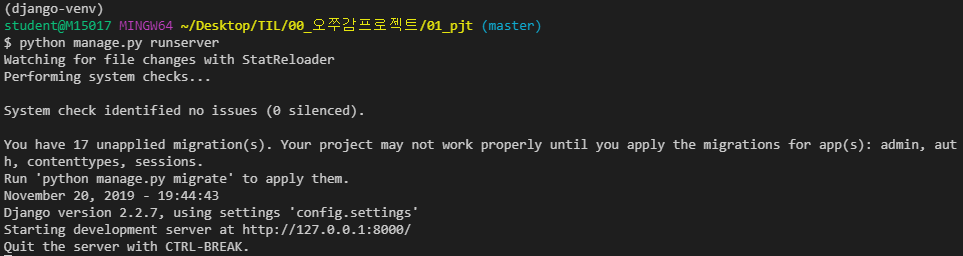
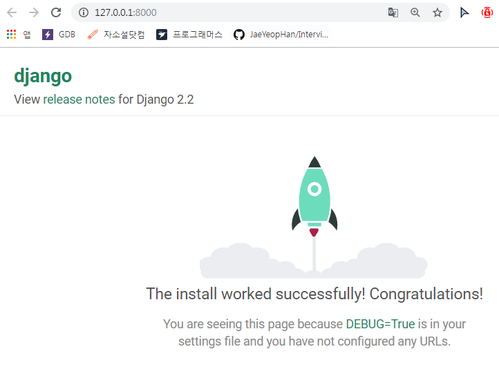
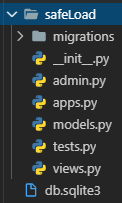
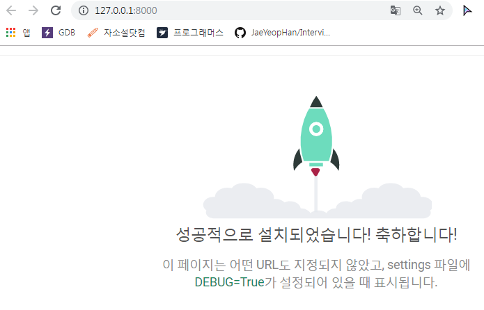

# 191028_Django 기본 설정

### 0. VScode 실행

### 1. 프로젝트 생성

### 2. 가상환경 생성

``` bash
$ python -m venv [가상환경이름]
```

### 3. interpreter 선택

- 이 작업을 해주면, **새 터미널 실행시 바로 가상환경 진입**

- Ctrl + Shift + P

  

- 새로 만든 가상환경 선택

  

- 이렇게!

  

### 4. `.gitignore` 파일 생성

- `.gitignore`생성 사이트 : <http://gitignore.io/>
  - `django`, `venv`, `vscode` 추가
-  프로젝트 폴더 안에 .gitignore 파일 생성



### 5. settings.json 설정

- Ctrl + Shift + P

- 아래 코드 붙여넣기

  ``` python
  "python.pythonPath": "venv\\Scripts\\python.exe",
  "files.associations": {
      "**/*.html": "html",
      "**/templates/**/*.html": "django-html",
      "**/templates/**/*": "django-txt",
      "**/requirements{/**,*}.{txt,in}": "pip-requirements"
  },
  "emmet.includeLanguages": {
      "django-html": "html"
  },
  "[django-html]": {
      "editor.tabSize": 4
  },
  ```

### 6. Django 설치

- 터미널에서 `pip intstall django` 입력

- `requirements.txt`로 한 번에 설치하려면

  ``` bash
  $ pip3 install -r requirements.txt 
  ```

- `requirements.txt`로 내보내려면

  ``` bash
  $ pip freeze > requirements.txt
  ```

- django가 잘 설치 되었는지 확인

  ``` bash
  $ python -m django --version
  ```

### 7. Django 프로젝트로 사용하기

- 폴더를 하나 생성

  ``` bash
  $ mkdir 00_django_intro
  $ cd 00_django_intro
  $ django-admin startproject config .
  ```

- `config` 폴더와 `manage.py`가 생성됨

  

  - `config` : 장고 프로젝트의 환경설정이 담기는 폴더

    - `__init__.py` : (default) 빈 파일

      ​							python에게 이 dir를 python config로 관리해줘!

    - `settings.py` : 각종 환경설정이 담기는 파일

      ​							static file, database, application 등록 등

    - `urls.py` : 사용자들의 경로와 우리의 `views.py`에 담긴 함수를 mapping 시켜주는 파일
    - `wsgi.py` : 장고 프레임워크의 규칙

  - `db.sqlite3` : 장고 프로젝트에 기본적으로 내장되어 있는 DB

  - `manage.py`: 장고 프로젝트와 의사소통할 때 쓰이는 커맨드 라인 utility

    ​					  장고 프로젝트에 명령을 내릴 때 manage.py를 통해 전달

### 8. 서버 실행

- `python manage.py runserver`

  - 로컬 서버 생성

    

  - ctrl + click

    

### 9. Application 생성

- 새로운 application 생성

  ``` bash
  $ python manage.py startapp [application이름]
  ```

  

  - `migrations`: DB Create, Update, Delete 등 db의 수정 기록들이 쌓이는 파일

  - `admin.py`: 관리자용 페이지를 커스터마이징 하는 파일

  - `apps.py` : safeLoad라는 해당 application의 구성 정보가 담기는 파일

  - `models.py`: MTV 모델에서 DB의 형식을 정의하는 파일

  - `tests.py`: test 코드를 작성하는 파일

  - `views.py`: **매우 중요**

    ​					MTV 모델에서 view 함수들이 여러 개 들어가는 파일

    ​					view : 사용자들에게 돌려줄 db를 내부적으로 가공하는 파일

- `config/settings.py`의 INSTALLED_APPS에 새로 만든 Application 출생신고!

  ``` python
  # Application definition
  INSTALLED_APPS = [
      # Local apps : 우리가 만든 템플릿
      'safeLoad',
      
      # Thired Party apps : 각종 라이브러리
      
      # Django apps : 기본 장고 설정
      'django.contrib.admin',
      'django.contrib.auth',
      'django.contrib.contenttypes',
      'django.contrib.sessions',
      'django.contrib.messages',
      'django.contrib.staticfiles',
  ]
  ...
  
  # 한국으로 설정
  LANGUAGE_CODE = 'ko-kr'
  TIME_ZONE = 'Asia/Seoul'
  ```

  

### 10. MTV란? (== MVC)

- Model : data를 정의하는 곳

  - `models.py` : DB 관리

- Template (== view) : 사용자가 보는 템플릿(화면)을 정의

  - `views.py` : 페이지 관리

    ​					 하나의 View 함수가 하나의 페이지를 관리

- View (== controller)

  - `urls.py` : url 주소 관리

    ​				   사용자가 특정한 경로로 들어왔을 때, 어떤 view 함수를 보여줄지 결정
