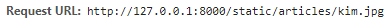

# 1029_Start Django 2

### 1. HTML Form tag

- static web vs dynamic web

  - static web : 단순히 html 페이지 여러 개로 구성 되어 있는 웹 서비스
  - dynamic web : DB에 변동을 주어서 DB에 따라 웹 사이트의 내용이 바뀌는 웹 서비스

- Form을 통해서 사용자로부터 정보를 받거나 정보를 가공하거나 하는 로직을 구현했는데, 결국 다이나믹 웹을 구현하기 위해서는 Form을 통해서 정보를 요청하는 절차가 반드시 필요

- \<form\>\</form\>

  - 사용자로부터 제공받은 데이터를 서버 측에 전송해주는 역할
  - 사용자가 여러 정보를 입력할 수 있는 수단을 제공
    - input 태그를 통해서
    - \<form action="/new/"> : 어디로 보낼 것인지 서버 측 경로를 지정
    - \<form action="" method="GET"> : 요청 방식을 무엇으로 할 것인지 지정

- \<input>

  - Form 태그 안에서 가장 중요한 태그
  - 사용자로부터 어떠한 정보를 입력받는 태그
  - \<input type=""> : 사용자가 입력할 데이터의 종류 지정
  - \<input type ="" name =""> : 서버측에서 사용자가 입력한 값을 가져올 이름으로 사용

  <br>

### 2. HTML Form - GET 요청

#### 2.1 기본 개념

- 요청의 종류 중 GET 요청은 **서버로부터 정보를 조회**하는데 사용

- 데이터를 서버로 전송할 때 **쿼리 스트링**을 통해 전송

- **서버의 데이터(리소스)를 변경 시키지 않는 요청**이고, HTML 파일을 조회할 때 사용

  - 서버에 GET 요청을 하면, HTML 문서 한 장을 받음

- throw & catch

  ```
  # throw & catch
  ```

#### 2.2 실습

```
# ASCII ART
```

<br>

### 3. HTML Form - POST 요청

- CRUD
  - Create : 생성
  - Read : 조회
  - Update : 수정
  - Delete : 삭제

#### 3.1 기본 개념

- POST 요청은 GET 요청처럼 쿼리스트링에 데이터가 노출되는 것이 아니라, **HTTP Body에 담겨서 전송**됨

  - GET 요청 -> Read
  - POST 요청 -> Create, Update, Delete

- POST 요청은 데이터(리소스)를 수정/삭제시키는 로직이기 때문에, 똑같은 요청을 여러번 시도하게 되면 서버에서 응답하는 결과를 다를 수 있음

- 원칙적으로 POST 요청을 보냈는데 HTML 파일을 그려주는(render) 응답은 해서는 안 됨

  -  HTML 파일을 그려주는 응답은 GET 요청에서만 사용

  - ex) 사용자가 로그인을 하는 로직은 POST 요청으로

    ​	  로직 마지막에 어떤 정보를 변수로 넘겨서 HTML 파일을 넘겨주는 로직을 구현하는게 아니라, 로그인이 끝나면 메인 페이지(`'/'`) 등으로 redirect 시켜주는 로직을 구현해야 함

- ``

  - CSRF 공격을 막기위한 최소한의 신원 확인 장치

  - 장고 내부적으로 CSRF 공격을 막기 위한 미들웨어가 기본적으로 적용

    ```
    # settings.py
    
    MIDDLEWARE = [
        ...
        'django.middleware.csrf.CsrfViewMiddleware',
        ...
    ]
    ```

    - CsrfViewMiddleware가 존재하기 때문에, Form에서 POST 요청을 할 때 ``을 넣지 않으면 `403 forbidden` 에러
      -  403 에러는 서버에는 정상적으로 접근을 하였으나, 권한이 없어서 접근하지 못하는 에러
    - **`GET 요청`**은 "HTML 파일 하나 줘!"라고 하는 단순한 정보 조회 로직이지만, **`POST 요청`**은 서버측 DB(리소스)에 변경을 요청하는 것이기 때문에 신원을 확인하는 절차가 없으면 임의의 공격을 통해 서버가 해킹 당하게 됨
    - ``을 코드에 삽입하면, 실제 Form 태그를 개발자 도구로 찍어보면 hidden type의 input 태그가 생기고 그 안에 암호화된 hash 값이 함께 전송되는 것을 확인할 수 있음

#### 3.2 실습

```
# user_new, user_create
```

- hidden type의 input 태그 확인

  

<br>

### 4. Static 파일

#### 4.1 기본 개념

- 정적 파일?
  - 별도의 가공 없이 사용자에게 그냥 전달만 해주면 되는 파일들
  - 예를 들어, 이미지, CSS, Javascript 파일
  - 서버(프로그래머)가 미리 준비해두고, 사용자는 그냥 받아보기만 하면 됨
  - 이미지의 경우, DB를 통해 저장한 것이 아니라면, 일정한 주소를 통해 이미지를 불러와야 되는데 로컬에 저장했을 경우, 그냥 경로만 적어서는 이미지를 불러올 수 없다
    
    - 장고에서 제공하는 static 파일 관리 방법을 준수해서 이미지를 불러와야 함
    
    <br>
  
- Static Files 기본 경로 : 애플리케잇녀 안에 있는 static 디렉토리를 탐색해서 정적 파일 가져옴

  - 기본 경로 커스터마이징 

  ``` python
  # settings.py
  # 웹 사이트에서 사용할 정적 파일의 최상위 url 경로
  STATIC_URL = '/static/'
  
  # 정적 파일이 위치한 경로
  # 앞으로 static 파일을 찾을 때 아래에 설정한 경로에 찾아가서 탐색
  # 개발 단계에서 사용 -> 실제 프로덕션 배포 단계에서는 다른 방식 사용
  STATICFILES_DIRS = [
      os.path.join(BASE_DIR, 'config', 'assets'),
  ]
  ```

- ``  : 해당 페이지에 정적 파일들을 불러와서 사용하겠다고 선언

  - `` 태그가 있으면 그 아래에 선언해야 함

- ``: 해당하는 경로에 있는 파일에 대해, 장고가 접근할 수 있는 **절대 URL 경로** 생성

  

#### 4.2 실습

``` html
<!-- 해당 페이지에 정적 파일들을 불러와서 사용하겠다고 선언 -->
<!-- 상속 받는 extends 태그가 있으면 그 아래에 선언 -->

<!DOCTYPE html>
...
  <!--  local에 저장되어 있는 static 파일 경로를 불러올 수 없음-->
  <!-- 최상단에  작성해야 불러올 수 있음-->
  <link rel="stylesheet" href="">
 
<body>
  <h1> 정적 파일 출력을 실습해봅시다! </h1>
  
</body>

</html>
```

<br>

### 5. URL 로직 분리

- 이때까지 프로젝트 폴더 - config. 안에 있는 urls.py에서 모든 URL 경로를 관리함

- Application이 많아지면 관리해야 할 URL 경로 또한 많아지면서 매우 복잡해짐

- 각자의 Application에 해당하는 URL은 Application이 직접 관리하도록 위임시켜보자

  <br>

#### 5.1 애플리케이션 만들기

```bash
$ python manage.py startapp utilitiesbash
```

``` python
# settings.py
INSTALLED_APPS = [
    'utilities',
    'pages',
    ...
]
```

<br>

#### 5.2 애플리케이션 urls.py 생성

```
config/
    urls.py
pages/
    urls.py
utilities/
    urls.py
```

<br>

#### 5.3 프로젝트 urls.py 로직 수정

- include 메서드를 사용해서 일정한 경로로 오는 요청들을

  애플리케이션의 urls.py에서 처리하도록 위임

  ``` python
  # config/urls.py
  
  from django.contrib import admin
  from django.urls import path,include
  
  urlpatterns = [
      # 사용자가 pages/로 시작하는 경로로 들어오면
      # pages 앱 안의 urls.py에서 처리해라
      path('pages/',include('pages.urls')),
      path('utilities/',include('utilities.urls')),
      path('admin/',admin.site.urls)
  ]
  ```

<br>

#### 5.4 pages 애플리케이션의 urls.py

``` python
# pages/urls.py (-> 다른 애플리케이션도 형식 동일)

from django.urls import path
from . import views
urlpatterns = [
    ...
    # 'http://localhost/pages/new/' 라는 경로로 요청했을 경우
    path('new/', views.new),  
    # 'http://localhost/pages/'라는 경로로 요청했을 경우
    path('', views.index)
]
```

<br>

### 6. 이름공간 (Namespace) 정리

- 장고는 기본적으로 템플릿(static도 동일) 파일을 탐색할 때,

  템플릿 폴더를 전부 모아놓고 setting에 등록한 순서대로 탐색함

  ``` 
  [As-is 폴더구조]
  pages/
      templates/
          index.html
  utiliites/
      templates/
          index.html
  
  [As-is 뷰 함수 - pages]
  def index(request):
      return render(request, 'index.html')
  
  [settings.py]
  INSTALLED_APPS = [
      'utilities',
      'pages',
      ...
  ]
  ```

  - 탐색하는 순서는 settings.py에 있는 INSTALLED_APPS 리스트 위에서부터 차례대로

  - 따라서 중간에 구분하는 폴더를 만들어주지 않은 경우,

    **나는 pages의 index.html 이라는 템플릿을 렌더링하고 싶었지만**

    **앱 등록 순서상 상위에 있는 utilities의 index.html 템플릿이 렌더링됨 **

  - templates 폴더 안에 폴더를 하나 더 만들어서 한단계 더 거치게 만들기!

  ``` 
  [As-is 폴더구조]
  pages/
      templates/
          index.html
  utiliites/
      templates/
          index.html
  
  [As-is 뷰 함수 - pages]
  def index(request):
      return render(request, 'index.html')
  
  [settings.py]
  INSTALLED_APPS = [
      'utilities',
      'pages',
      ...
  ]
  ```

<br>

### 7. 템플릿 상속(Template inheritance)

#### 7.1 개본 개념

- 상속은 기본적으로 코드의 재사용성에 초점
  - 템플릿에서 반복되는 코드는 미리 만들어두고 가져다 쓰자!

#### 7.2 실습

- base.html : 상속할 html 파일

- `   '`   

  `  ` 로 상속받아 사용할 부분 표시

```django
<!DOCTYPE html>
<html lang="en">
<head>
  <meta charset="UTF-8">
  <meta name="viewport" content="width=device-width, initial-scale=1.0">
  <meta http-equiv="X-UA-Compatible" content="ie=edge">
   
   
</head>
<body>
  <h1>base.html 템플릿을 상속받았습니다.</h1>
  
  
</body>
</html>
```

- index.html

  - base.html의  ` ` 자리에 삽입

  ```django
  
  
  
  <h1>첫번째 앱</h1>
  
  
  
  <h1>Hello! Django~</h1>
  
  ```

<br>

### 8. 개발환경 관리

- 협업 프로젝트 시 공통된 파이썬 패키지를 설치할 수 있도록 해줌
  - Github에 패키지까지 같이 올려서 용량이 커지는 경우 방지
  - 패키지 리스트만 넘겨줘서 받는 사람이 패키지 설치할 수 있도록 함
- 파이썬 버전의 경우, 파일에 저장되지 않기 때문에 따로 명시
  - README.md

```
# 현재 가상환경에 설치되어 있는 패키지 리스트 목록을 파일로 만들기
$ pip freeze > requirements.txt

# 패키지 리스트 목록을 읽어서, 없는 패키지를 자동으로 설치하기
$ pip install -r requirements.txt
```

