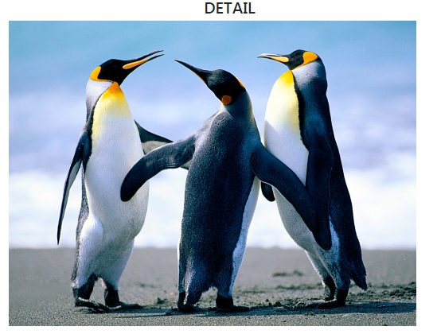

# 191105_사용자 이미지 업로드하기

### 모델링

``` python
# articles/models.py

class Article(models.Model):
    ...
    # 원래는 새로운 필드를 추가하고 나면
    # makemigrations를 할 때, 어떤 값을 넣을 것인지
    # Django가 물어봄
    # 기본 적으로 blank = False 이기 때문
    # blamk = True : '빈 문자열'이 들어가도 됨
    image = models.ImageField(blank=True)
    ...
```

- 코드 상으로는 중간에 삽입했지만, 실제 DB 테이블에서는 맨 뒤에 추가 됨

- Migration : `blank=True` 옵션으로 인해, 기본 값으로 어떤 값을 넣을지 묻는 절차가 생략 됨

  ``` bash
  $ python manage.py makemigrations
  $ python manage.py migarate
  ```

### View

``` python
def create(request):
    if request.method == 'POST':
        ...
        image = request.FILES.get('image')
```


``` html
<!-- config/templates/articles/create.html -->
...
<form action="" method="POST" 
      enctype="multipart/form-data">
    ...
<label for="image"> IMAGE</label>
<input type="file" name="image" id="image" accept="image/*">
...
```

- `accept="image/*"` : 설정 시 파일 선택할 때 image 파일만 뜨게 함

  ​									  But, 확장자를 바꾸면 업로드 가능, HTML에서는 유효성 검사를 할 수 없음

  ​									  views.py에서 유효성 검사를 해줘야 함!

  

- 인코딩 타입

  - `application/x-www-form-urlencoded` : (기본값) 모든 문자 인코딩

  - `multipart/form-data` : 전송되는 데이터 형식 지정

    ​											**파일/이미지 업로드 시 반드시 사용**

    ​								            데이터와 파일을 따로 나누어서 전송함

  - `text/plain` : 인코딩 X

``` python
# articles/admin.py
# image 추가
class ArticleAdmin(admin.ModelAdmin):
    list_display = ('pk','title','content','created_at','updated_at','image', )
```

``` html
<!-- config/templates/articles/detail.html -->

<!--  
  article.image.url : 파일 주소
  articles.image : 파일 이름 (sample.png)
-->
...
<p> </p>
```


#### 현재는 업로드 된 파일이 root directory 아래에 저장됨

#### 지정된 폴더에 저장되도록 설정해보자!

``` python
# media files
# 업로드 된 파일의 주소를 만들어주는 역할
MEDIA_URL = '/media/'

# 실제로 파일이 업로드 된 다음에
# 어디로 저장될 것인지 경로를 설정
MEDIA_ROOT = os.path.join(BASE_DIR,'media')
```

- 업로드한 이미지가 뜨지 않음!

  

- static 파일처럼 파일을 불러오는 경로를 mapping 해줘야 함

  - static은 django에서 이미 지정해 놓음

  

  - 업로드한 파일이 저장되는 media 폴더와 mapping 해보자!

    ``` python
    # config/urls.py
    from django.conf import settings
    from django.conf.urls.static import static
    
    # 파일 업로드 시, 업로드 된 파일이 저장되는 위치를 지정하는 코드
    # static() 
    # 첫번째 인자 : 어떤 URL을 정적으로 추가할 지 (현재는 Media file)
    # 두번째 인자 : 실제 해당 미디어 파일은 어디에 있는지, 경로
    urlpatterns += static(settings.MEDIA_URL, document_root = settings.MEDIA_ROOT)
    ```

  - 이미지가 잘 뜨는지 확인

    


- update.html 수정

  - 문제 : input type이 file일 경우 value 값을 미리 지정을 못함

    ​		  이미지 파일은 binary 데이터로 들어가서, 텍스트를 수정하듯이 일부만 수정하는 것이 불가능

    ​		  새로운 사진을 덮어쓰는 방식을 사용

    - 당장 해결하는 방법 : 똑같은 사진을 업로드하도록 유도

      ​								   사진 파일을 업데이트 페이지에 띄워 놓기

  ``` html
  <form action="" method="POST" enctype="multipart/form-data">
      ...
      
  ```

- detail.html

``` html
<!--
  1. 샘플 이미지를 넣어두고, 이미지가 없는 게시글은 샘플 이미지 표시
  2. 이미지가 있는 경우에만 이미지 표시
    -->





<p> 사진이 없어요...</p>



```

