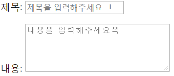
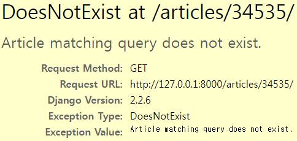
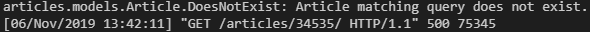
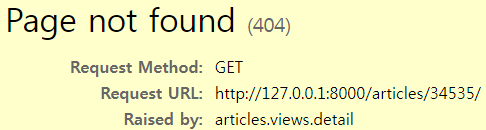

# 191106_Django form

### 1. 사전 준비

> Django Form을 적용하기 전, 이때까지 우리가 학습했던 HTML Form으로 앱을 구현해보자.

- **프로젝트 생성**

  ```
  $ mkdir 04_django_form
  $ cd 04_django_form
  ```

  ```
  $ django-admin startproject config .
  ```

- **앱 생성**

  ```
  $ python manage.py startapp articles
  ```

- **Article Model**

  ```
  # models.py
  ```

- **URL 설정**

  ```
  # config/urls.py
  ```

  ```
  # articles/urls.py
  ```

- **base.html 생성** (부트스트랩 적용X)

- **Index 페이지** (-> 모든 게시글 보여주기)

  ```
  # views.py
  def index(request):
      pass
  ```

  ```
  <!-- index.html -->
  ```

- **Create 페이지**

  ```
  # views.py
  def create(request):
      pass
  ```

  ```
  <!-- create.html -->
  ```

- **Detail 페이지**

  ```
  # views.py
  def detail(request, article_pk):
      pass
  ```

  ```
  <!-- detail.html -->
  ```


## 2. Django Form


- form의 장점(-> 자동화)
  - blank=True 와 같은 옵션을 따로 지정해주지 않았으면, HTML 태그에 required 옵션을 자동으로 붙여줌
  - 기존에 max_length와 같은 조건을 어길 경우, 에러 페이지를 출력
    - Django form을 써서 에러 메시지 출력함

- label

``` python
from django import forms
class ArticleForm(forms.Form):
    title = forms.CharField(max_length=30,
                            # label : HTML tag와 동일한 기능
                            label='제목',
                            # widget : Input Type 지정 -> Textarea / 알맞은 속성값 부여
                            widget=forms.TextInput(
                                attrs={'class': 'title',
                                       'placeholder': '제목을 입력해주세요...!',
                                      }))
    content = forms.CharField(label='내용',
                              widget=forms.Textarea(
                                  attrs={'class': 'content',
                                      	 'placeholder': '내용을 입력해주세요옥',
                                         'rows': 5,
                                         'cols': 30,
                                  	    }))
```

- 실행 결과

  


## ERROR 500

- 문제 : 사용자가 이상한 URL 주소를 쳤을 때, ERROR 404가 아니라 500이 뜸





- 해결

  ``` python
  from django.shortcuts import ..., get_object_or_404
  
  def detail(request, article_pk):
      article = get_object_or_404(Article,pk = article_pk)
      # article = Article.objects.get(pk=article_pk)
      context = {'article': article, }
      return render(request, 'articles/detail.html', context)
  ```

  

