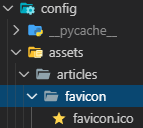
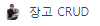

# 191106_favicon 설정

- <https://www.favicon-generator.org/> : favicon 만드는 사이트

- 아이콘 이미지 생성 후 favicon.ico 파일을 static 폴더에 저장

  

  

- html 파일에 작성

``` html

<link rel ="shortcut icon" href ="" type="image/x-icon">
```

- 실행 결과



