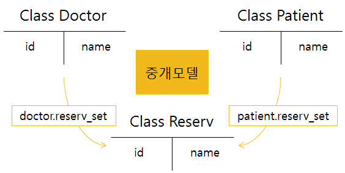
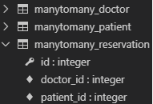
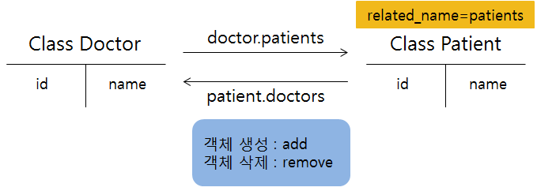
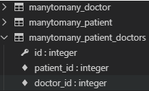

# 191112_Model Relationships

## 1. Many to One

- 현재 User와 Article의 관계는 User : Article = 1: N 관계
  - [참조] article.user
  - [역참조] user.article_set 


#### 0. 환경 설정

- 05_model_relation 폴더 생성

​	`$ django-admin startproject config .`

​	`$ python manage.py startapp manytoone`

``` python
# settings.py

INSTALLED_APPS = [
    'manytoone',
    
	# ipython shell 사용하기 위해 선언
    'django_extensions',
]
```

``` python
# models.py

from django.db import models

# Create your models here.
class User(models.Model):
    name = models.TextField()

    def __str__(self):
        return f'{self.name}'

class Article(models.Model):
    title = models.TextField()
    user = models.ForeignKey(User,on_delete=models.CASCADE)

    def __str__(self):
        return f'{self.title}'

class Comment(models.Model):
    content = models.TextField()
    article=models.ForeignKey(Article,on_delete=models.CASCADE)
    user = models.ForeignKey(User,on_delete=models.CASCADE)
    
    def __str__(self):
        return f'{self.content}'
```

<br>

####  Query 실습

- `python manage.py shell_plus`
- 객체 생성

``` sqlite
user1 = User.objects.create(name=‘Kim’)
user2 = User.objects.create(name=‘Lee’)
article1 = Article.objects.create(title=‘1글’, user=user1)
article2 = Article.objects.create(title=‘2글’, user=user1)
article3 = Article.objects.create(title=‘3글’, user=user2)
c1 = Comment.objects.create(content=‘1글1댓글’, user=user1, article=article1)
c2 = Comment.objects.create(content=‘1글2댓글’, user=user2, article=article1)
c3 = Comment.objects.create(content=‘1글3댓글’, user=user1, article=article1)
c4 = Comment.objects.create(content=‘1글4댓글’, user=user2, article=article1)
c5 = Comment.objects.create(content=‘2글1댓글‘, user=user1, article=article2)
c6 = Comment.objects.create(content=‘!1글5댓글‘, user=user2, article=article1)
c7 = Comment.objects.create(content=‘!2글2댓글’, user=user2, article=article2)
```

<br>

- ~.query : ORM이 DB에 전송하는 ~에 대한 Query문 출력

- user1이 작성한 게시글 다 가져오기

  ``` sqlite
  In []: user1.article_set.all()
  Out[]: <QuerySet [<Article: 1글>, <Article: 2글>]>
  ```

- user1이 작성한 모든 게시글에 달린 댓글 가져오기

  ``` sqlite
  In []: for articles in user1.article_set.all():
         	   for comment in articles.comment_set.all():
          	   print(comment.content)
  
  # 출력결과
  1글1댓글
  1글2댓글
  1글3댓글
  1글4댓글
  !1글5댓글
  2글1댓글
  !2글2댓글        
  ```

- 2번 댓글을 작성한 User?

  ``` sqlite
  In [] : c2.user
  Out[] : <User: Lee>
  
  In [] : c2.user.pk
  Out[] : 2
  ```

- 2번 댓글을 작성한 사람의 모든 게시글

  ``` sqlite
  In [] : c2.user.article_set.all()     
  Out[] : <QuerySet [<Article: 3글>]>
  ```

- 1번 글의 첫번째 댓글을 작성한 사람의 이름?

  ``` sqlite
  In []: article1.comment_set.all()[0].user.name
  Out[]: 'Kim'
  
  In []: article1.comment_set.first().user.name
  Out[]: 'Kim'
  ```

- 1번 글의 2번째부터 4번째까지 댓글 가져오기

  ``` sqlite
  In []: article1.comment_set.all()[1:4]
  Out[]: <QuerySet [<Comment: 1글2댓글>, <Comment: 1글3댓글>, <Comment: 1글4댓글>]>
  ```

  ``` sqlite
  In [24]: print(article1.comment_set.all()[1:5].query)
  SELECT "manytoone_comment"."id", "manytoone_comment"."content", "manytoone_comment"."article_id", "manytoone_comment"."user_id" FROM "manytoone_comment" WHERE "manytoone_comment"."article_id" = 1  LIMIT 4 OFFSET 1
  ```

- 1번 글의 1번째,2번째 댓글 가져오기

  ``` sqlite
  In []: article1.comment_set.all()[:2]
  Out[]: <QuerySet [<Comment: 1글1댓글>, <Comment: 1글2댓글>]>
  ```

- 1번 글의 두번째 댓글을 작성한 사람의 첫번째 게시물의 작성자의 이름?

  ``` sqlite
  In []: article1.comment_set.all()[1].user.article_set.all()[0].user.name
  Out[]: 'Lee'
  ```

- 1번 댓글의 user 정보만 가져오기

  ``` sqlite
  Comment.objects.values('user').get(pk=1)
  ```

- 2번 사람이 작성한 댓글을 pk 내림차순으로 가져오기

  ``` sqlite
  In []: user2.comment_set.order_by('-pk')
  Out[]: <QuerySet [<Comment: !2글2댓글>, <Comment: !1글5댓글>, <Comment: 1글4댓
  글>, <Comment: 1글2댓글>]>
  ```

- 제목이 '1글'이라는 게시글 전부 가져오기

  ``` sqlite
  In []: Article.objects.filter(title='1글')
  Out[]: <QuerySet [<Article: 1글>]>
  ```

- 1:N 관계로만 구현하려고 하니 예약 정보 시스템 표현하기 힘듦

  - 예를 들어, Patient가 다른 Doctor에게 진료를 받고자 할 때,

    기존 의사의 기록을 지우지 않으려면 새로운 Patient 인스턴스를 생성해야 함

  - 중개모델(Class Reservation)을 만들어서 Doctor와 Patient를 이어주는 예약 정보를 담아보자

  <br>

## 2. Many to Many

- N : N 관계  (= 다대다 관계)

- **Django의 ManyToManyField** 사용해서 N : N 관계 참조

``` python
from django.db import models

# Create your models here.
class Doctor(models.Model):
    name = models.TextField()

    def __str__(self):
        return f'{self.pk}번 의사 {self.name}'


class Patient(models.Model):
    name = models.TextField()
    doctors = models.ManyToManyField(Doctor,through = 'Reservation')

    def __str__(self):
        return f'{self.pk}번 환자 {self.name}'

class Reservation(models.Model):
    doctor = models.ForeignKey(Doctor,on_delete=models.CASCADE)
    patient = models.ForeignKey(Patient,on_delete=models.CASCADE)
```

<br>

### through 

- Patient 입장에서 중개모델을 거쳐서 reservation_set 형태로 예약정보를 가져오는 것은 **매우 불편**

  - Doctor 입장에서도  reservation_set 형태로 예약 정보를 먼저 불러와야 환자 정보 열람이 가능함

  

  ```python
  class Patient(models.Model):
      name = models.TextField()
      doctors = models.ManyToManyField(Doctor,
                                       through = 'Reservation')
  ```

  ``` sqlite
  In []: doctor1.reservation_set.all()
  Out[]: <QuerySet [<Reservation: 1번 의사의 1번 환자>]>
  
  In []: patient1.reservation_set.all()
  Out[]: <QuerySet [<Reservation: 1번 의사의 1번 환자>]>
  ```

<br>

- DB 구조



- Doctor 정보를 중개모델을 거치지 않고 바로 가져와보자

  <br>

### related_name

- 의사의 입장에서 환자 정보를 바로 가져오기

  - `related_name='patients'`

  

  ```python
  class Patient(models.Model):
      name = models.TextField()
      doctors = models.ManyToManyField(Doctor,
                                       related_name='patients')
  ```

  ``` sqlite
  In []: doctor1.patients.add(patient2)
  In []: doctor1.patients.all()
  Out[]: <QuerySet [<Patient: 2번 환자 세환>]>
  
  In []: doctor1.patients.remove(patient2)
  In []: doctor1.patients.all()
  Out[]: <QuerySet [<Patient: 2번 환자 세환>]>
  ```

  

- 단순히, Doctor와 Patient를 이어서 사용하려면, 굳이 중개모델을 생성할 필요 X

  `ManyToManyField`로  Django가 이어줌

  ``` python
  from django.db import models
  
  # Create your models here.
  class Doctor(models.Model):
      name = models.TextField()
      def __str__(self):
          return f'{self.pk}번 의사 {self.name}'
  
  
  class Patient(models.Model):
      name = models.TextField()
      doctors = models.ManyToManyField(Doctor,related_name='patients')
      def __str__(self):
          return f'{self.pk}번 환자 {self.name}'
  ```

  <br>

  - 중개모델을 만들지 않았지만 DB를 확인해보면 Django가 임의의 테이블을 생성해준 것을 확인할 수 있음

  