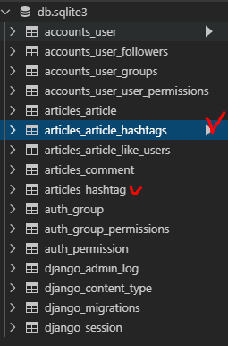
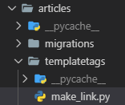
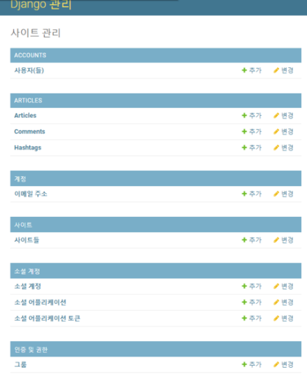
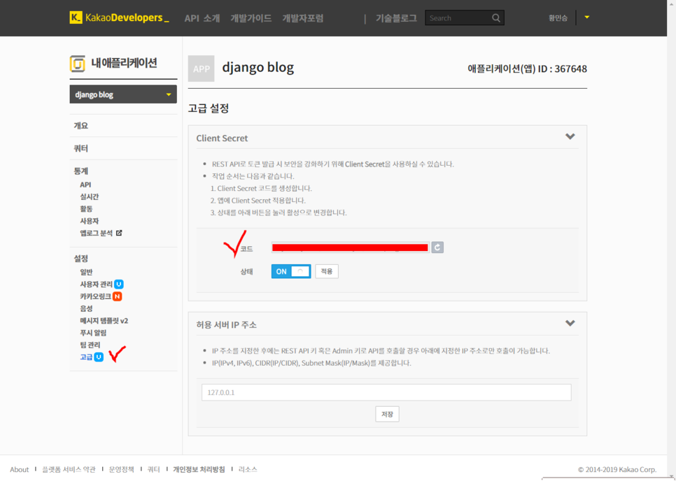
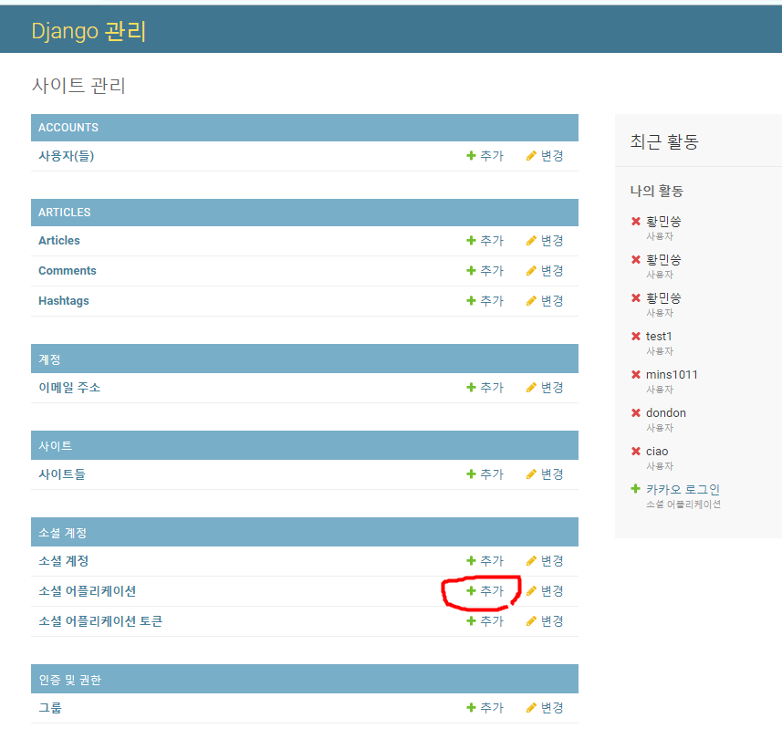
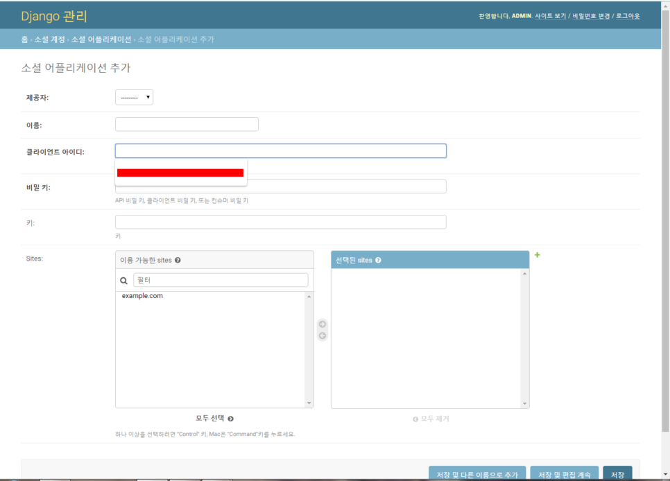
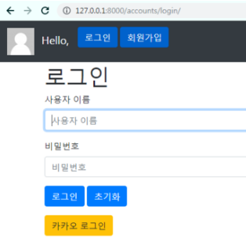
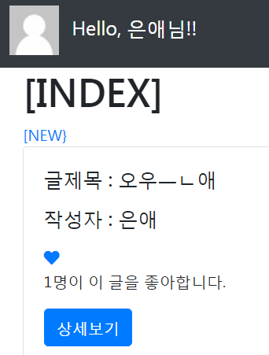

# Hashtag / Social Login

## 1. Hashtag

### 1.1 Model

``` python
class Hashtag(models.Model):
    content = models.TextField(unique=True)

class Article(models.Model):
    ....
    hashtags = models.ManyToManyField(Hashtag, blank=True)    # hashtag를 안 할 수도 있으니까 blank=True 속성 부여 
```



- `unique=True`
  - True인 경우, 필드는 테이블을 전체에서 고유한 값이어야 한다.
  - 유효성 검사 단계에서 실행되며, 중복 값이 있는 모델을 저장하려고 하면 `.save()` 메서드로 인해서 에러가 발생한다.

- `get_or_create()`
  - word와 같은 해시태그를 찾고있으면 기존 객체 반환, 없으면 새로운 객체 생성
  - `hashtag, created = Hashtag.objects.get_or_create(content=word)`
    - 새로운 객체 생성되면 created=True
    - 기존 객체 반환되면 created=False

### 1.2 CREATE

#### 1.2.1 로직 설계하기

1. **사용자가 업로드한 content**
"오늘 수능날....난 출근...#행복 하다...ㅋ...옛날생각나ㅔ..또..#감성 #추억 #뿌듯 #수능왕

2. **.split() 메소드로 리스트 형식으로 변환**
['오늘' '수능날' '난' '출근' '#행복' '하다' '옛날생각나네'....'#감성','#추억']

3. **리스트 반복문 돌려서 앞자리가 #으로 시작하는 단어를 해시태그 테이블에 등록**

  - `for word in article.content.split():`

  - 같은 해시태그가 오면 기존에 설정한 unique=True 옵션으로 인해 에러 발생
  - 이를 방지하기 위해 get_or_create() 사용!

4. **동시에 해당 게시글 해시태그 목록에 추가해줌**

  - `article.hashtags.add(word)`

    

``` python
# views.py

@login_required
def create(request):
    # POST 요청일 경우 -> 게시글 생성 로직 수행
    if request.method == 'POST':
        form = ArticleForm(request.POST)                # 유효성 검증
        if form.is_valid():
            article = form.save(commit=False)
            article.user = request.user
            article.save()         
            
            # hashtag # 게시글 내용을 잘라서 리스트로 만듦
            for word in article.content.split():
                # word '#'으로 시작할 경우 해시태그 등록
                if word[0] == '#':
                    hashtag, created = Hashtag.objects.get_or_create(content=word)
                    article.hashtags.add(hashtag)
                    
        return redirect('articles:detail', article.pk)
    else:
        form = ArticleForm()
    context = {'form': form}
    return render(request, 'articles/form.html', context)
```

- content를 읽어와서 space를 기준으로 리스트로 쪼갠뒤에 #으로 시작하는 단어들을 hashtag에 저장한다.

  ``` python
  hashtag, created = Hashtag.objects.get_or_create(content=word)
  ```

  - 이때, 이 코드는 읽은 데이터가 Hashtag 테이블에 이미 있는 데이터일 경우에는 created에 False라는 값을 반환하고 저장되어 있지 않을 경우에는 테이블에 저장하고 True값을 반환한다

  - hashtag에는 읽어온 값을 넣는다 (ex. #행복, #감성, #추억)

  - 동시에 article 테이블에 있는 hashtags 속성에도 hashtag값을 저장한다.


### 1.4 UPDATE

업데이트 하는과정에서 해시태그 내용이 바뀔 수 도 있으니, 기존에 등록했던 해시태그 내용을 다 지우고 다시 저장하는 방식으로 간다.

``` python
@login_required
def update(request, article_pk):
    article = get_object_or_404(Article, pk=article_pk)
    if request.user == article.user:
        if request.method == 'POST':
            form = ArticleForm(request.POST, instance=article)
            if form.is_valid():
                article = form.save()
                
                # hashtag
                article.hashtags.clear()
                for word in article.content.split():
                    if word.startswith('#'):
                        hashtag, created = Hashtag.objects.get_or_create(content=word)
                        article.hashtags.add(hashtag)
                        
                return redirect('articles:detail', article.pk)
        else:
            form = ArticleForm(instance=article)
    else:
        return redirect('articles:index')
    context = {
        'form': form,
        'article': article,
    }
    return render(request, 'articles/form.html', context)
```


- Article 테이블의 hashtags 속성이 지워질 뿐, Hashtag 테이블의 내용이 삭제되는 것은 아님

### 1.5 Read

- hashtag를 \<a> 태그로 감싸서 링크를 걸어주자!



``` python
# make_link.py

from django import template

register = template.Library()

@register.filter
def hashtag_link(article):
    content = article.content + ' '
    hashtags = article.hashtags.all()

    for hashtag in hashtags:
        content = content.replace(hashtag.content+' ', f'<a href="/articles/{hashtag.pk}/hashtag/">{hashtag.content}</a> ')
    return content
```

``` html
<!-- detail.html -->
...
글 내용 : {{article|hashtag_link|safe}} <br>
```


## 2. Social Login

> 인증, 계정, 등록 등을 다루는 여러가지 방법이 존재하는데, 우리는 **django-allauth라는 라이브러리를 사용해서 손쉽게 Social Login을 구현해보자.**
>
> 대부분의 소셜 로그인을 지원하고 회원가입 시킬 수 있다.

### 2.1 사전준비

- `pip install django=allauth`

  <https://django-allauth.readthedocs.io/en/latest/installation.html>

- settings.py 에 추가

  ``` python
  # settings.py
  AUTHENTICATION_BACKENDS = (
      'django.contrib.auth.backends.ModelBackend',
  )
  INSTALLED_APPS = [
      'accounts',
      'articles',
      'bootstrap4',
      'django_extensions',
      'allauth',
      'allauth.account',
      'allauth.socialaccount',
      'allauth.socialaccount.providers.kakao',
      'django.contrib.sites',
      'django.contrib.admin',
      'django.contrib.auth',
      'django.contrib.contenttypes',
      'django.contrib.sessions',
      'django.contrib.messages',
      'django.contrib.staticfiles',
  ]
  
  SITE_ID = 1
  ...
  # 로그인 후 리다이렉트 경로
  LOGIN_REDIRECT_URL = 'articles:index'
  ```

  ``` python
  # config의 urls.py
  
  urlpatterns = [
      ...
      path('accounts/', include('allauth.urls')),
  ]
  ```

- `python manage.py makemigrations`
- `python manage.py migrate`



### 2.2 Kakao Developers `OAuth` 등록

- <https://developers.kakao.com/>
- [내 애플리케이션] - [앱 만들기] - [REST API 키] 사용

- 코드 복사

  

- admin 사이트에서 설정

  1. 소셜 계정 - 소셜 어플리케이션 - 추가

  

  2. 소셜 어플리케이션 추가

     - 이름 : 카카오 로그인

       클라이언트 아이디 : REST API 키

       비밀 키 : 위에서 복사한 코드

     - 마지막으로 Sites에서 클릭해서 오른쪽으로 넘겨주고 저장

  

<bR>

- 이제 로그인 폼을 새로 만들어보자

  - 기존의 auth_form.html 가져와서 수정

    ``` html
    <!-- accounts/templates/accounts/login.html -->
    
    
    
    
    
    
      <h1>회원가입</h1>
    
      <h1>로그인</h1>
    
      <h1>회원정보수정</h1> 
    
      <h1>비밀번호　변경</h1>
    
    
    <form action="" method="POST">
      
      
      
      
      <a href="" class="btn btn-warning">카카오 로그인</a>
    </form> 
    
    ```

  - views.py에서 login 부분의 return 수정

    ``` python
    # account/views.py
    
    def login(request):
        # 이미 로그인 되어있는 친구가 로그인 하려고 하면
        if request.user.is_authenticated:
            return redirect('articles:index')
        
        if request.method == 'POST':
            form = AuthenticationForm(request, request.POST)
            if form.is_valid():
                auth_login(request, form.get_user())
                # return redirect('articles:index')
                return redirect(request.GET.get('next') or 'articles:index')
        else:
            form = AuthenticationForm()
        context = {
            'form' : form,
        }
        
        # 수정
        return render(request, 'accounts/login.html', context)
    ```

  - settings.py

    ``` python
    ...
    
    # 로그인 후 리다이렉트 경로
    LOGIN_REDIRECT_URL = 'articles:index'
    ```

- 실행결과

  

