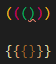
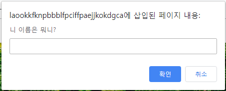

# 191118_JavaScript Syntax basics

- Node.js 발표와 동시에 javascript가 브라우저 종속적인 언어가 아니라 서버 구축까지 가능해지면서 핫한 언어로 급부상

- `Express.js`(서버), `React.js`(프론트), `Vue.js`(프론트) 등 javascript 기반의 

## 0. 사전준비

### 0.1 Node.js 설치

- node.js 공식 홈페이지 : <https://nodejs.org/>
  - LTS Version (안정적)
  - Windows Installer (.msi) 64bit

- 설치확인

  ``` bash
  $ node -v
  v12.13.0
  ```

### 0.2 VSCode Python & JavaScript 인덴팅 설정

-  [파일] - [기본 설정] - [설정]

  - Editor : Tab size = 2

    

- [Ctrl + Shift + P] - [settings.json] 열기

  ```python
  {	
      ...
      "editor.tabSize":2,
      "[python]":{
          "editor.tabSize":4,
      },
  }
  ```

### 0.3 Extensions

- Rainbow Brackets 설치
- indent-rainbow 설치



<br>

## 1. Variable

> 00_variable.js 참고

### 1.1 let (변수)

- 값을 재할당 할 수 있는 변수를 선언하는 키워드
- 변수 선언은 한 번만 할 수 있음
  - 할당은 여러 번 할 수 있음

- 블록 유효 범위 (Block scope)를 갖는 지역 변수

``` javascript
// let(변수)
let x = 1 
// let x = 3 // Error : Identifier 'x' has already been declared

x = 3 // 재할당 가능
console.log(x) // 출력 : 3

if (x === 1) {
  let x = 2
  console.log(x) // 출력 : 2
}
console.log(x) // 출력 : 1
```

<br>

### 1.2 const (상수)

- 값이 변하지 않는 상수를 선언하는 키워드
  - 상수의 값은 재할당을 통해 바뀔 수 없고, 재선언도 불가능
  - 초기값을 생략하면 Error
- let과 동일하게 Block scope를 가짐
- 웬만하면 모든 선언에서 상수를 써야 함
  - 일단 상수를 사용하고, 값이 바뀌는 것이 자연스러운 상황이면 그 때 변수(let)로 바꿔서 사용하는 것을 권장

<br>

- **변수와 상수는 어디에 써야 할까?**
  - 어디에 변수를 쓰고, 어디에는 상수를 쓰고 하는 것은 프로그래머의 몫
  - 파이 근삿값과 같은 값은 상수가 적절 -> 변할 일 없는 값
- `var` **vs** `let` **vs** `const`
  - var : 할당 및 선언 자유, 함수 스코프
  - let : 할당 자유, 선언은 한번만, 블록 스코프
  - const : 할당 및 선언 한번만, 블록 스코프

- var : Hoisting과 같은 여러 문제를 야기하기 때문에, let과 const만 이용하자

<br>

## 2. 조건문

### 2.1 if문

> 01_if.js 참고

- 파이썬의 if문과 흡사
  - `elif` -> `else if` 로 바꾸기만 하면 됨


> Web console창에서 실습

``` javascript
> const userName = prompt('니 이름은 뭐니?')
> userName
"몰라"
```



``` javascript
let message = ''
if (userName ==='도현'){
    message = '유단자'
}else if(userName === '혁진'){
    message = '감자'
}else{
    // 값을 불러오려면 ` `로 감싸기
	message = `<h1> ${userName}..누구?</h1>`
}
document.write(message)
```


<br>

## 3. 반복문

> 02_loop.js 참고

- `while`문
  - while 키워드 뒤에 나오는 조건이 true일 때 반복

- `for`문

  -  javascript의 가장 기본적인 반복문
  - for문에서 사용할 변수 하나를 정의하고, 그 변수가 특정 조건에 false 값이 될 때까지 연산 & 반복

  ``` javascript
  // python의 for in 문법과 비슷하게 사용 가능
  const numbers = [1, 2, 3, 4, 5]
  for(let number of numbers){
    console.log(number)
  }
  
  for(let number of [1, 2, 3, 4, 5]){
    console.log(number)
  }
  ```

<br>

## 4. 함수

> 03_function.js 참고

### 4.1 선언식

``` javascript
// 선언식 : 코드가 실행되기 전에 load 됨

console.log(add(3,5))

function add(num1, num2) {
  return num1 + num2
}
console.log(add(1,2))
```

### 4.2 표현식

``` javascript
// 표현식 : 함수를 변수에 담기
// 코드가 실행된 후 load 됨

// console.log(sub(3,1)) -> Error
const sub = function(num1,num2){
  return num1-num2
}
console.log(sub(4,2))

// 타입 확인하면 둘 다 function type
// 동작 방법만 다름
console.log(typeof add) // function
console.log(typeof sub) // function
```

<br>

## 5. 화살표 함수 (Arrow function)

> 03_function.js 참고

- ES6 이후 
- function과 중괄호 숫자를 줄이려고 고안된 문법
  - function 키워드 생략 가능
  - 함수의 매개변수가 하나라면, **() 생략 가능**
  - 함수의 body 부분에 표현식이 하나라면, **{}와 return 생략 가능**
- 화살표 함수의 경우 function 키워드로 정의한 함수와 100% 동일하진 않음

- 화살표 함수는 항상 익명함수

  ``` javascript
  // 기본 함수
  const iot1 = function (name) {
    return `hello, ${name}!!`
  }
  
  // 화살표 함수 (Arrow function)
  // 1. function 키워드 삭제
  const iot1 = (name) => { retrun `hello, ${name}!!` }
  
  // 2. () 생략 (함수 매개변수가 하나일 경우)
  const iot1 = name => { retrun `hello, ${name}!!` }
  
  // 3. {}, return 생략 (함수 바디에 표현식이 하나일 경우)
  const iot1 = (name) => `hello, ${name}!!`
  ```

- [실습] 3단계에 걸쳐 화살표 함수로 바꿔보자

  ``` javascript
  let square = function(num){
  	return num ** 2
  }
  
  let square  = (num) => { return num ** 2 }
  
  let square = num => { return num ** 2 }
  
  let square  = num => num ** 2
  ```

- 인자가 없는 화살표 함수

  ``` javascript
  > let noArgs = () => 'No args'
  > noArgs = _ => 'no args!!@'
  > noArgs()
  "no args!!@"
  ```

- object 담기

  ``` javascript
  // 5-1. object를 return을 명시적으로 적어줌
  let returnObject = () => { return { key: 'value' } }
  
  console.log(returnObject()) // { key: 'value' }
  console.log(typeof returnObject()) // object
  
  // 5-2. return을 적지 않으려면 괄호 붙이기
  let returnObject = () => ({  key: 'value' })
  
  console.log(returnObject())
  console.log(typeof returnObject())
  
  //6. 기본 인자 부여하기 (Default Args)
  //인자 개수와 상관 없이 반드시 괄호를 붙인다
  const sayHello = (name='혁진') => 'hi! ${name}'
  ```

- 화살표함수는 기본적으로 익명 함수지만, 변수 및 상수에 할당해서 기명 함수처럼 사용 가능

  ``` javascript
  const square = num => num ** 2
  ```

<br>

## 6. 익명 / 1회용 함수 (Anonymous function)

- javascript에서는 1회용으로 사용하는 함수는 이름을 짓지 않을 수 있음

  - function 키워드를 활용해서 함수를 선언할 때는, 이름을 지정하지 않으면 Error

    ``` javascript
    function (num) {return num ** 3} // Error
    ```

  1. 기명 함수로 만들기 (변수, 상수에 할당) 

     ```javascript
     const func = function (num) {return num ** 3}
     ```

  2. 익명함수 바로 실행하기

     ``` javascript
     > console.log(
     	(function (num) {return num ** 3})(2)
     )
     
     8
     ```

- 일반적으로는 함수를 정의, 변수에 함수를 저장하는 과정 등을 거쳐서 실행함
  - 하지만, **즉시실행함수**는 함수가 선언되자마자 즉시 실행 됨

- 사용 목적 : **초기화**에 사용 됨
  - 즉시실행함수는 선언되자마자 실행되기 때문에, 같은 함수를 다시 호출할 수 는 없음.

- 다시 사용하려면 변수에 담아야 함


## 7. Array

### 7.1 Array 함수

- `length` : 배열의 길이 return

- `push()` : 배열의 맨 마지막에 요소 추가 후 배열 길이 return  

- `pop()` : 배열의 맨 마지막 요소 제거 후 제거된 요소 return 

- `unshift()` : 배열 가장 앞에 요소 추가 후 배열의 새로운 length return

- `shift()` : 배열 가장 앞에 요소 제거 후 제거된 요소 return 

- `indexOf()` : 중복된 요소가 존재하는 경우 맨 처음에 찾은 요소의 index return

  ​					   찾고자 하는 요소가 없으면 -1 return

- `join()` : 배열의 요소를 join 함수의 인자를 기준으로 묶어서 문자열로 return


``` javascript
> const numbers = [1,2,3,4,5]
> numbers[0]
1
> numbers[-1] // 양의 index만 가능
undefined 

> numbers.length
5
> numbers.reverse() // 원본 Array 자체를 reverse시킴
[5, 4, 3, 2, 1]

> numbers.reverse() 
[1,2,3,4,5]

> numbers.push('a')
6

> numbers
[1,2,3,4,5,"a"]

>numbers.pop()
"a"

> numbers.unshift('a')
6

> numbers
["a",1,2,3,4,5]

> numbers.shift()
"a"

> numbers
[1,2,3,4,5]

> numbers.push('a','b')
[1,2,3,4,5,"a","b"]

> numbers.unshift('a')
8

> numbers
["a",1,2,3,4,5,"a","b"]

> numbers.indexOf('a')
0

> numbers.indexOf('b')
7

> numbers.indexOf('c')
-1

> numbers.join()
"a,1,2,3,4,5,a,b"


> numbers.join('-')
"a-1-2-3-4-5-a-b"

> numbers.join('')
"a12345ab"
```

<br>

## 7. 객체 (Object)

> 05_object.js 참고

``` javascript
> const me = {
   name: 'ㅇㅇ', // key가 한 단어일 때
   'phone number': '01012345678', // key가 여러 단어일 때
   appleProducts: {
     iphone: 'xs',
     watch: 'series5',
     macbook: 'pro2019'
   }
 }

> me.name
"ㅇㅇ"

// key가 여러 단어일 때, []로 접근
> me['phone number']
"01012345678"

> me.appleProducts
{iphone: "xs", watch: "series5", macbook: "pro2019"}

> me.appleProducts.iphone
"xs"
```

<br>

> 06_object2.js 참고

- **ES5 이전**

``` javascript
// ES5 버전
var books = ['자바스크립트 입문', '장고 웹 프로그래밍']
var comics = {
  'DC': ['Aquaman', 'Joker'],
  'Marvel': ['Avengers', 'Spider man']
}
var magazines = null

var bookShop = {
  books: books,
  comics: comics,
  magazines: magazines
}

> console.log(bookShop)
{
  books: [ '자바스크립트 입문', '장고 웹 프로그래밍' ],
  comics: { DC: [ 'Aquaman', 'Joker' ], Marvel: [ 'Avengers', 'Spider man' ] },
  magazines: null
}

> console.log(typeof bookShop)
object

> console.log(bookShop.books[0])
자바스크립트 입문
```

<BR>

- **ES6 이후**

``` javascript
// ES6 이후
let books = ['자바스크립트 입문', '장고 웹 프로그래밍']
let comics = {
  'DC': ['Aquaman', 'Joker'],
  'Marvel': ['Avengers', 'Spider man']
}
let magazines = null

// 객체의 key와 value가 똑같으면 , 마치 배열처럼 한 번만 작성 가능
const bookShop = {
  books,
  comics,
  magazines
}
```

<BR>

### 7.1 JSON과 비교

> 07_JSON.js 참고

- JavaScript Object Notation - JavaScript 객체 표기법

- 웹에서 데이터를 주고 받을 때, 대표적인 형식으로 JSON, XML, YAML 등이 있음

  - 주로, JSON 사용

- Key-Value 형태의 자료구조로, JavaScript Object와 유사한 모습으로 표현하는 표기법

- 하지만, JSON은 형식만 비슷할 뿐이고 실제로 Object처럼 사용하려면

  다른 언어들과 마찬가지로 **Parsing(구문 분석)하는 작업이 필요**함

- **[ JSON  vs JavaScript Object ] 단순 비교**
  - JSON : 데이터를 표현하기 위한 단순 문자열 ( String )
  - JavaScript Object : JavaScript의 Key-Value 쌍의 자료구조

``` javascript
// Object -> String
const jsonData = JSON.stringify({ // JSON -> String
  도현: '합기도',
  혁진: '감자',
})

> console.log(jsonData)
{"도현":"합기도","혁진":"감자"}

> console.log(typeof jsonData)
string

// String -> Object
const parseData = JSON.parse(jsonData)

> console.log(parseData)
{ '도현': '합기도', '혁진': '감자' }

> console.log(typeof parseData)
object
```

<br>

## 8. Array Helper Method

> 08_forEach.js 참고

- Helper란 자주 사용하는 로직을 재활용 할 수 있게 만든 일종의 library
- ES6부터 본격적으로 사용됨
- 상세한 사용법 : **MDN** 문서 참고

### 8.1 `forEach`

- `arr.forEach(callback(element, index, array))`

  - 주어진 callback을 배열에 있는 각 요소에 대해 한 번씩 실행

  ``` javascript
  // ES5 for loop
  var iot1 = ['도현', '혁진', '은애']
  for (var i = 0; i < iot1.length; i++) {
    console.log(iot[i])
  }
  
  // ES6+
  const IOT1 = ['수연', '선아', '주현']
  IOT1.forEach(function (student) {
    console.log(student)
  })
  
  // 한 줄로 리팩토링 가능
  IOT1.forEach(student => console.log(student))
  
  const res = IOT1.forEach(student => console.log(student))
  > console.log(res)
  undefined
  ```

- [실습] for를 forEach로 바꾸기

  ``` javascript
  function handleStudents() {
    const students = [{
      id: 1,
      name: '오은애',
      status: '응애?'
    }, {
      id: 15,
      name: '서혁진',
      status: '감자?'
    }, {
      id: 28,
      name: '김영선',
      status: '쉽다쉬훠'
    }]
  
    // for (let i = 0; i < students.length; i++) {
    //   console.log(students[i])
    //   console.log(students[i].name)
    //   console.log(students[i].status)
    // }
    students.forEach(student => console.log(student, student.name, student.status))
  }
  ```

- [실습] images 배열 안에 있는 정보를 곱해 넓이를 구하여 areas 배열에 저장

  ``` javascript
  const images = [{
      height: 30,
      width: 55
    },
    {
      height: 50,
      width: 178
    },
    {
      height: 81,
      width: 35
    }
  ]
  const areas = []
  
  images.forEach(image =>
    areas.push(image.height * image.width)
  )
  
  > console.log(areas)
  [ 1650, 8900, 2835 ]
  ```

  