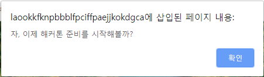
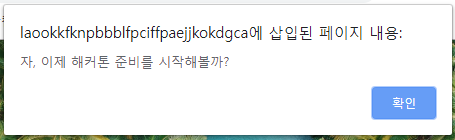
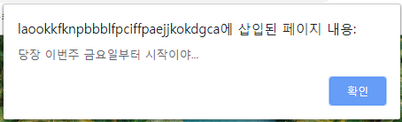
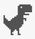
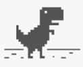
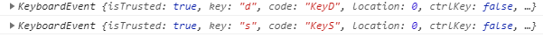
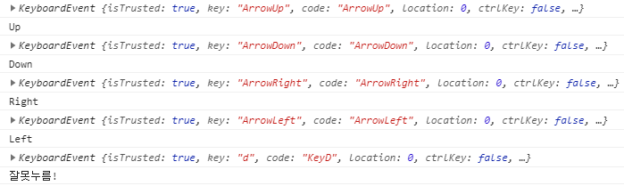

# 191119_ Callback & EventListener & Dino

## 1. Callback Function

> 01_callback.html 참고

<br>

### 1.1 정의

- **다른 함수에 인수로 넘겨지는 함수**

- 특정 이벤트가 발생했을 때 시스템에 의해 호출되는 함수

- "좀 이따 너 실행 끝나면 나 다시 불러줘! (call back)"

- 자주 사용되는 대표적인 예 -> 이벤트 핸들러 처리

  ```html
  <body>
    <button id="my-button">클릭해주세요</button>
      
    <script>
      const button = document.getElementById('my-button')
      button.addEventListener('click', function() {
        console.log('버튼이 클릭됐어요!')
      })
    </script>
  </body>
  ```

### 1.2 예시

1. **함수 정의**

   ```javascript
   function doSomething(task) {
   	alert(`자, 이제 ${task} 준비를 시작해볼까?`)
   }
   doSomething('해커톤')
   ```

   

   <Br>

2. **익명 함수인 콜백 함수 추가**

   ```javascript
   function doSomething(task, callback) {
   	alert(`자, 이제 ${task} 준비를 시작해볼까?`)|
   	callback()
   }
   
   doSomething('해커톤', function() {
   	alert('당장 이번주 금요일부터 시작이야... :)')
   })
   ```

   

   

   <br>

3. **기명 함수인 콜백 함수**로 변경해서 추가

   ```javascript
   function doSomething(task, callback) {
   	alert(`자, 이제 ${task} 준비를 시작해볼까?`)|
   	callback()
   }
   function alertStart() {
   	alert('당장 이번주 금요일부터 시작이야... :)')
   }
   doSomething('해커톤', alertStart)
   
   // Alerts: 자, 이제 해커톤 준비를 시작해볼까?
   // Alerts: 당장 이번주 금요일부터 시작이야... :)
   ```

<br>

## 2. EventListener

> 02_event_listener.html

### 2.1 정의

- 특정한 **이벤트가 발생했을 때 실행되는 함수** 또는 절차

  1. 무엇을 -> EventTarget
  2. 언제 -> Type의 행위를 했을 때
  3. 어떻게 -> (주로) Listener에 구현된 함수를 실행

- `addEventListener` 메소드 구성 요소

  > **EventTarget.addEventListener(type, listener)**
  >
  > - **EventTarget** : 이벤트 리스너를 등록할 대상 (-> DOM 노드)
  >
  > - **type** : 이벤트 유형을 뜻하는 문자열 (`click`, `mouseover` 등)
  >
  > - listener
  >
  >   : 이벤트가 발생했을 때 처리를 담당하는 콜백 함수
  >
  >   - 인수로 이벤트 객체인 `e` 를 전달받음

<BR>

### 2.2 예시

1. (무엇을) 특정한 DOM 요소를 -> button을
2. (언제) 어떠한 행동을 했을 때 -> click 했을 때
3. (어떻게) 한다 -> '뿅'한다.

``` javascript
// 1. 무엇을 -> 버튼을
const button = document.querySelector('#this-button')
// 2. 언제 -> 버튼을 'click'하면
button.addEventListener('click', function (event) {
    console.log(event)
    // 3. 어떻게 -> '뿅'하고 나온다
    const area = document.querySelector('#my')
    area.innerHTML = '<h1>뿅!</h1>'
})
```

<BR>

## 3. Google dino

> 03_google_dino.html 참고

<br>

### 3.1 BOM & DOM

- **BOM (Browser Object Model)**

  - JavaScript가 브라우저와 소통하기 위한 모델

    - 브라우저 제작사마다 세부사항이 다소 다르게 구현되고 한정적임
    - 웹 브라우저의 창, 프레임을 추상화해서 프로그래밍적으로 제어할 수 있도록 수단을 제공
    - 전역 객체인 `window`의 프로퍼티와 메소드들을 통해서 제어할 수 있음

  - window 객체는 모든 브라우저로부터 지원 받으며, 이는 브라우저 window 자체를 의미

  - **모든 전역 JavaScript 객체, 함수, 변수들은 자동으로 window 객체의 멤버가 된다.**

    - **HTML DOM에 있는 document 객체 역시 window 객체의 속성이다.**

    ```javascript
    window.print()		// 인쇄창 열기
    window.open()		// 브라우저 탭 열기
    window.confirm()	// 브라우저 대화상자 열기
    window.document		// document 역시 브라우저에 종속 -> window 전역 객체에 포함됨
    ```

    <br>

- **DOM (Document Object Model)**

  - JavaScript로 브라우저를 조작하기 위한 언어. **DOM을 통해서 HTML 파일에 작성되는 여러 요소(Element)들을 조작**할 수 있다.
  - DOM이라는 객체를 통해서 **요소를 선택**할 수도 있고, 선택한 **요소의 속성 값을 수정하거나 삭제**할 수도 있어요.
  - **요소에 이벤트를 등록**해서, 특정 이벤트가 발생할 시 특정 함수를 실행하도록 만들 수도 있다.
  - HTML 문서에 작성하지 않은 **새로운 요소를 생성**해서 **원하는 위치에 삽입**할 수도 있다.

  <br>

### 3.2 사전준비

- 기본 dino 코드

```html
<!DOCTYPE html>
<html lang="en">
    <head>
        <meta charset="UTF-8">
        <meta name="viewport" content="width=device-width, initial-scale=1.0">
        <meta http-equiv="X-UA-Compatible" content="ie=edge">
        <title>Document</title>
        <style>
            .bg {
                background-color: #f7f7f7;
                display: flex;
                justify-content: center;
                align-items: center;
                min-height: 100vh;
            }
        </style>
    </head>

    <body>
        <div class="bg">
            
        </div>
        <script>
        </script>
    </body>
</html>
```

<br>

### 3.3 요소(Element) 선택

- JavaScript를 이용해서 요소를 선택해서 객체로 반환하기
- 브라우저 환경에서 사용하는 JavaScript에는 document 객체가 내장되어 있다. 이 객체를 통해서 HTML 파일을 조작할 수 있다.

<br>

#### 3.3.1 요소 선택하여 변수 할당하기

- `document`의 `querySelector` 혹은 `querySelectorAll` 함수를 통해 CSS 선택자로 원하는 요소를 선택할 수 있다.

  - `querySelector` : 위에서부터 선택자로 요소를 찾으며 가장 먼저 찾아지는 요소 반환 (-> 단수)

    ```javascript
    document.querySelector('.bg')
    ```

  - `querySelectorAll` : 위에서부터 선택자로 요소를 찾으며 일치하는 요소를 전부 반환 (-> 복수)

    ```javascript
    document.querySelectorAll('.bg')
    ```

- 변수 할당하기

  ```javascript
  const bg = document.querySelector('.bg')
  ```

  - `.bg` 라는 클래스가 가진 태그, 그 자식태그까지 전부 변수에 담는다.

<br>

### 3.4 속성 추가 및 삭제

- DOM 객체를 통해 요소의 속성이나 값을 수정 및 삭제할 수 있다.

#### 3.4.1 요소의 속성 확인

- 마치 객체의 속성에 접근하는 것처럼 `.`을 통해 요소의 속성에 접근할 수 있다.

```javascript
dino.src
// "https://blahblah~"
dino.id
// "dino"
```

#### 3.4.2 요소의 속성 변경

- 접근한 속성에 직접 값을 할당할 수 있다.
- 변경 전



- 변경 후

  

```javascript
dino.src = 'https://miro.medium.com/max/300/0*9U_PkckAUtKGrb_R.png'
```

<br>

#### 3.4.3 요소의 스타일 변경

- 요소의 스타일은 style 속성을 통해 접근할 수 있다. 속성 값을 수정하듯이 값을 할당하면 된다.

```javascript
dino.style.marginRight = '20px'
```

<br>

### 3.5 요소 추가 및 삭제

#### 3.5.1 요소 삭제 : remove

- 요소가 가지고 있는 `remove` 함수를 통해 해당 요소를 삭제할 수 있다.

  ```javascript
  const dino = document.querySelector('#dino')
  dino.remove()
  ```

  <br>

#### 3.5.2 대상의 자식 요소 삭제 : removeChild

- 자식을 선택해서 삭제할 수 있다.

- `removeChild` 함수를 통해 `querySelector`로 가져온 태그 내의 특정 자식 요소를 삭제할 수 있다.

  ```javascript
  const bg = document.querySelector('.bg')
  const dino = bg.querySelector('#dino')
  
  bg.firstElementChild.remove() // 첫번째 자식 요소 삭제
  bg.lastElementChild.remove()  // 마지막 자식 요소 삭제 (지금은 하나밖에 없음)
  bg.removeChild(dino)          // 자식 요소 중 특정 요소를 선택해서 삭제
  ```

  <br>

#### 3.5.3 새로운 요소 생성 : createElement

- `createElement` 함수를 통해서 새로운 요소를 생성할 수 있다.
- 새롭게 생성한 태그는 어떠한 속성이나 값이 없는 상태이기 때문에 일일이 값을 할당해주어야 한다.

<br>

#### 3.5.4 대상에 요소 추가하기 : append, insertBefore

- 단순한 태그 생성만으로는 새로운 요소가 DOM에 자동으로 렌더링되지는 않는다.

- 삽입하고 싶은 위치에서 부모 요소의 `append` 함수를 통해 **가장 뒤에 추가**해주거나,

- `insertBefore` 함수를 통해 **자식 요소 중 특정 요소 전에 삽입**할 수 있다.

  ```javascript
  const bg = document.querySelector('.bg')
  
  // div 태그의 자식 태그 중 마지막에 요소를 추가
  bg.append(newDino)
  // div 태그의 자식 태그 중 가장 처음에 요소를 추가
  bg.insertBefore(newDino, bg.firstElementChild)
  ```

<br>

## 3.6 대상에 EventListener 추가

- 요소에 이벤트를 동록하여 해당 이벤트가 발생할 때마다 설정한 함수가 실행 되도록 한다.
- 이벤트(Event) : 어떤 사건
  - 사용자가 버튼 클릭했을 때, 웹 페이지가 정상적으로 로드되었을 때 등
- 이벤트가 발생하는 시점 및 순서는 **예측 불가**하므로, 이벤트가 발생하는 순간을 감지하고 그에 대응하는 처리가 필요하다.
- **브라우저는 이벤트를 감지할 수 있고, 이벤트가 발생하면 이를 알려준다**. 그래서 웹 페이지는 사용자와 상호작용(Interaction)이 가능해진다.

<br>

#### 3.6.1 이벤트 등록 : addEventListener

- `addEventListener`를 통해 특정 요소에 이벤트를 등록할 수 있다.

  - 첫 번째 인수: 이벤트의 Type
  - 두 번째 인수: 실행하고자 하는 함수

- MDN 이벤트 참조 (**자세한 내용 문서 참고**!)

  1. 키보드 이벤트

     - `keydown` : 키를 눌렀을 때
     - `keyup` : 키 누름이 해제될 때

  2. 마우스 이벤트

     - `click` : 포인팅 장치 버튼 (요소에서 눌렀다가 놓였을 때)

  3. 진행 이벤트

     - `error` : 진행 실패했을 때
     - `load` : 진행 성공했을 때

     <br>

#### 3.6.2 발생한 이벤트 확인

- `addEventListener` 함수는 이벤트가 발생할 때마다 실행시키는 함수의 인자로 **event** 라는 객체를 넘겨준다. 이 객체를 통해 어떤 이벤트가 발생했는지 확인할 수 있다.

  - `event` 객체는 일반적으로 줄여서 `e`라고 정의한다.

    ```javascript
    dino.addEventListener('click', function(e) {
        console.log(e)
        console.log('아야!')
    })
    ```

    <br>

### 3.7 문서 전체에 EventListener 추가

> 해당 페이지 전체에 키보드 입력 이벤트를 등록하여 어떤 키가 눌렸는지 확인해보자.

#### 3.7.1 이벤트 등록 및 입력 키 확인하기

- 키보드 입력 이벤트 중 `keydown`을 사용해서 키보드 이벤트 등록

``` javascript
 document.addEventListener('keydown', function (e) {
            console.log(e)
 })
```



<br>

#### 3.7.2 조건문으로 입력 값 구분하기

```javascript
document.addEventListener('keydown', function(e) {
    console.log(e)
    if (e.code === 'ArrowUp') {
        console.log('Up')
    } else if (e.code === 'ArrowDown') {
        console.log('Down')
    } else if (e.code === 'ArrowLeft') {
        console.log('Left')
    } else if (e.code === 'ArrowRight') {
        console.log('Right')
    } else if (e.code === 'Space') {
        console.log('Spacebar')
    } else {
        console.log('잘못 눌렀어요...!')
    }
})
```



<br>

### 3.8 살아 움직이는 공룡

#### 3.8.1 [LEVEL 1] 방향키 입력 시 공룡이 움직이게 만들기

> dino의 style에 margin 값을 부여하면...? -> `dino.style.marginRight = '20px'`

- 한 번만 움직이고 더이상 움직이지 않는다.

  - margin 값을 더해주는 것이 아니라, 똑같이 20px이라는 값을 재할당하고 있기 때문이다.

  <br>

#### 3.8.2 [LEVEL 2] 방향키 입력 시 공룡이 움직이게 만들기

- `x`와 `y` 변수에 기본값 0을 할당하고, 방향키가 입력될 때마다 margin 값을 계속해서 더하고 빼고 하는 과정을 통해서 공룡의 위치를 이동시키자.

``` javascript
document.addEventListener('keydown', function (e) {
    console.log(e)
    if (e.code === 'ArrowUp') {
        y += 20
        dino.style.marginBottom = `${y}px`
        console.log('Up')
    } else if (e.code === 'ArrowDown') {
        y -= 20
        dino.style.marginBottom = `${y}px`
        console.log('Down')
    } else if (e.code === 'ArrowLeft') {
        x -= 20
        dino.style.marginLeft = `${x}px`
        console.log('Left')
    } else if (e.code === 'ArrowRight') {
        x += 20
        dino.style.marginLeft = `${x}px`
        console.log('Right')
    } else if (e.code === 'Space') {
        console.log('크아앙')
        console.log('SpaceBar')
    } else {
        console.log('잘못누름!')
    }
})
```

<br>

#### 3.8.3 마우스를 피해서 도망가는 공룡

- `Math.random()` : 0~1 사이의 부동 소수점 난수를 발생하는 함수
- `window.innerWidth` : 윈도우 창의 너비
- `window.innerHeight` : 윈도우 창의 높이

``` javascript
// 움직이는 공룡
dino.style.position = 'absolute'
dino.addEventListener('mouseover', function () {
    // [현재 윈도우 너비 * 난수] - [현재 윈도우 너비 / 2]
    const newWidth = window.innerWidth * Math.random() - window.innerWidth / 2

    // [현재 윈도우 높이 * 난수] - [현재 윈도우 높이 / 2]
    const newHeight = window.innerHeight * Math.random() - window.innerHeight / 2

    // 새로운 값을 dino의 마진 값으로 할당
    dino.style.marginLeft = newWidth + 'px'
    dino.style.marginTop = newHeight + 'px'
})
```

