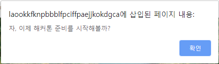
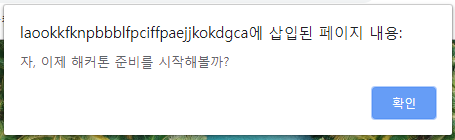
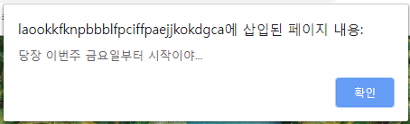

# 191119_크아아앙 공룡 만들기

## 1. Callback Function

#### 1.1 정의

- **다른 함수에 인수로 넘겨지는 함수**

- 특정 이벤트가 발생했을 때, 시스템에 의해 호출되는 함수

- 조금 이따가 너 실행 끝나면 나 다시 불러줘! => callback

- 자주 사용되는 대표적인 예 : 이벤트 핸들러 처리

  ``` html
  <body>
    <button id="my-button">클릭해주세요</button>
  
    <script>
      const button = document.getElementById('my-button')
      button.addEventListener('click', function () {
        console.log('버튼이 클릭됐어요!')
      })
    </script>
  </body>
  ```

<br>

#### 1.2 예시

1. 함수 정의

   ``` javascript
   function doSomething(task){
       alert(`자, 이제 ${task} 준비를 시작해볼까?`)
   }
   doSomething('해커톤')
   ```

   

2. 익명 함수인 콜백 함수 추가

   ``` 
   function doSomething(task, callback){
       alert(`자, 이제 ${task} 준비를 시작해볼까?`)
   	callback()
   }
   
   doSomething('해커톤',function(){
   	alert('당장 이번주 금요일부터 시작이야...')
   })
   ```

   

   

3. 기명 함수인 콜백 함수로 변경

   ```javascript
   function doSomething(task, callback){
       alert(`자, 이제 ${task} 준비를 시작해볼까?`)
   	callback()
   }
   
   function alertStart(){
   	alert('당장 이번주 금요일부터 시작이야...')}
   
   doSomething('해커톤', alertStart)
   
   // Alert : 자, 이제 해커톤 준비를 시작해볼까?
   // Alert : 당장 이번주 금요일부터 시작이야...
   ```

<br>

## 2. EventListener

#### 2.1 정의

- 특정한 이벤트가 발생했을 때 실행되는 함수 또는 절차

  1. 무엇을 -> EventTarget
  2. 언제 -> Type의 행위를 했을 때
  3. 어떻게 -> (주로) Listener에 구현된 함수를 실행

- `addEventListener` 메소드 구성 요소

  - `EventTarget.addEventListener(type,listener)`

    - EventTarget : 이벤트 리스너를 등록할 대상 (-> DOM 노드)

    - type : 이벤트 유형을 뜻하는 문자열 (`click`, `mouseover` 등)

    - listener : 이벤트가 발생했을 때 처리를 담당하는 콜백 함수

      - 인수로 이벤트 객체인 `e`를 전달받음

      <br>

#### 2.2 예시

1. (무엇을) 특정한 DOM 요소를 -> Button을

2. (언제) 어떠한 행동을 했을 때 -> click 했을 때

3. (어떻게) 한다 -> '뿅'한다

   ``` javascript
   <body>
       <div id="my">
           
       </div>
       <button id="this-button">Click me!</button>
       <script>
           // 1. 무엇을 -> 버튼을
           const button = document.querySelector('#this-button')
           // 2. 언제 -> 버튼을 'click'하면
           button.addEventListener('click', function (event) {
               console.log(event)
               // 3. 어떻게 -> '뿅'하고 나온다
               const area = document.querySelector('#my')
               area.innerHTML = '<h1>뿅!</h1>'
           })
       </script>
   </body>
   ```

   <BR>

## 3. Google dino

#### 3.1 BOM & DOM

- **BOM (Browser Object Model)**

  - javascript가 브라우저와 소통하기 위한 모델

    - 브라우저 제작사마다 세부사항이 다소 다르게 구현되고 한정적
    - 웹 브라우저의 창, 프레임을 추상화해서 프로그래밍적으로 제어할 수 있도록 수단을 제공
    - 전역 객체인 `window`의 프로퍼티와 메소드들을 통해서 제어 가능

  - `window`객체는 모든 브라우저로부터 지원받으며, 이는 브라우저 `window` 자체를 의미

  - **모든 전역 javascript 객체, 함수, 변수들은 자동으로  window 객체의 멤버가 됨**

    - **HTML DOM에 있는 document 객체 역시 window 객체의 속성이다**

    ``` javascript
    window.print() 		// 인쇄창 열기
    window.open()		// 브라우저 탭 열기
    window.confirm()	// 브라우저 대화상자 열기
    window.document()	//document 역시 브라우저에 종속 -> window 전역 객체에 포함됨
    ```

    <BR>

- **DOM (Document Object Model)**
  - javascript로 브라우저를 조작하기 위한 언어
  - **DOM을 통해서 HTML 파일에 작성되는 여러 요소(element)들을 조작**할 수 있음
  - DOM이라는 객체를 통해서 **요소를 선택**할 수도 있고, 선택한 **요소의 속성값을 수정하거나 삭제**할 수 있음
  - **요소에 이벤트를 등록**해서, 특정 이벤트가 발생하면, 특정 함수를 실행하도록 만들 수도 있음
  - HTML 문서에 작성하지 않은 **새로운 요소를 생성**해서 **원하는 위치에 삽일**할 수 있음

