# 191120_Axios/Ajax 비동기 처리

- HTTP -> Ajax(HTTP를 효과적으로 활용) -> WebSocket

## Axios

> 01_axios.js 참고

- 브라우저와 Node.js에서 사용할 수 있는 Promise 기반의 **HTTP 클라이언트 라이브러리**
  - 비동기 방식으로 HTTP 데이터 요청을 실행한다.
  - 내부적으로는 직접적으로 XMLHttpRequest를 다루지 않고 **Ajax 호출을 보낼 수 있다**.
- `Promise`(ES6)
  - 비동기 요청을 보내고 응답을 받았을 때, 그 응답 결과를 어떻게 처리하자고 약속(Promise)하는 것
  - `.then` : 응답이 **정상적**으로 왔을 경우 -> 이제 **어떻게 처리할지 결정**
  - `.catch` : 응답이 **비정상적**인 경우 -> **에러** 처리

- prototype 개발할 때 테스트 할 수 있는 사이트 : <https://jsonplaceholder.typicode.com/>

  - 실습

    ``` javascript
    // 01_axios.js
    const axios = require('axios')
    axios.get('https://jsonplaceholder.typicode.com/posts/1')
      .then(response => {
        console.log(response)
      })
      .catch(error => {
        console.log(error)
      })
    ```

  - 실행시키기 :`node [실행시킬 .js 파일명]`

    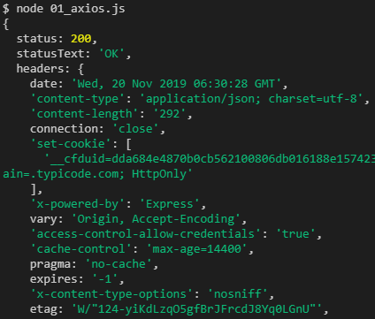

<br>

## 1. Dog and Cat

> 02_Dogs_and_Cats.html 참고

### 1.1 Dog API 

- <https://dog.ceo/>

#### 1.1.1 설치

- Node.js

  ```
  $ npm install axios
  ```

### 1.2 [실습] Cat API

- [The Cat API](https://thecatapi.com/)

### 1.3 실행 결과

- 초기 화면

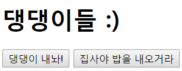

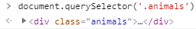

<br>

- 댕댕이 내놔! 버튼 클릭

  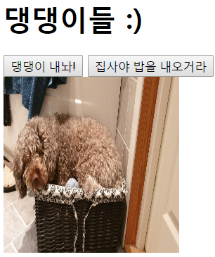

  - 함수 호출때마다 자식 div 태그를 만들어 Dog의 사진을 추가해 줄 수 있도록 getDogImage라는 함수를 ㄹ만들어서 axios 코드에 넣어줌

    ``` javascript
    const getDogImage = () => {
        axios.get('https://dog.ceo/api/breeds/image/random' )
        .then(response=>{
          // 1. url을 변수에 담는다.
          const imgUrl = response.data.message  
          // 2. img 태그를 만든다.      
          const imgTag = document.createElement('img')
          // 3. src를 추가한다.
          imgTag.src = imgUrl
          imgTag.style.width = '200px'
          imgTag.style.height = '200px'
          // 4. html 문서에 요소를 위치시킨다.
          document.querySelector('.animals').append(imgTag)
        }).catch(error=>{
          console.log(error)
        })
      }
    const dogButton = document.querySelector('#dog')
    dogButton.addEventListener('click', getDogImage)
    ```

  - getDogImage() 호출하면 Dog 사진 추가 됨

    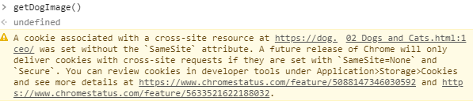

    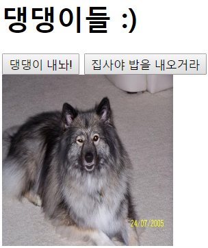

<br>

- 고양이 버튼 추가 & getCatImage() 추가

  <br>

## 2. Like (GET 요청)

- `AJAX`

  - Asynchronous JavaScript and XML

  - 브라우저에서 웹페이지를 요청하거나 링크를 클릭하면 화면갱신(새로고침)이 일어남

    이는 브라우저와 서버 간의 통신이 일어났다는 이야기임

  - `Ajax` : **JavaScript를 활용해서 비동기적으로 서버와 브라우저가 데이터를 교환할 수 있는 통신 방식**

  - 페이지 전체를 다시 로드하는 것이 아니라,

    페이지에서 갱신이 필요한 일부분만 로드함으로써 빠른 퍼포먼스와 부드러운 화면 표시가 가능!

    - 사용자 경험(UX) 향상 + 서버 자원 이용 절감 -> 두 마리 토끼 다 잡기!

- `XHR(XMLHttpRequest)`

  - **브라우저는 XHR 객체를 이용해서 AJAX 요청을 생성하고 전송**함
  - 서버가 브라우저 요청에 응답 내용을 반환하면, 마찬가지로 XHR 객체가 그 결과를 처리함

  <br>

### 2.1 좋아요 버튼을 부~드럽게

- 이전에 우리가 구현해 둔 장고 코드에서는 좋아요 버튼을 누르면 페이지 전환(요청)을 통해 좋아요 기능이 이루어짐
- 하지만 axios를 사용하면 페이지 전환 없이 좋아요 기능을 구현할 수 있음

<bR>

#### 2.1.1 a 태그 삭제, i 태그 수정

- `<a href="">` 태그 지우기

- i 태그의 class = "like-button fas fa-heart" 로 변경

- i 태그에 data-id 추가해서 js가 `querySelector`함수로 선택할 수 있도록 함

``` html
 <p class="card-text">
        <!-- 사용자가 좋아요 누른 상태 -> 꽉찬 하트 -->
        <!-- data-id : JS가 데이터를 처리할 때 해당 요소가 어떤 article의 번호인지
					   구분하기 위해서 지정 -->
        
        <i data-id="{{article.pk }}" class="like-button fas fa-heart"
           style="color:crimson; cursor : pointer"></i>
        <!-- 사용자가 좋아요 안 누른 상태 -> 빈 하트-->
        
        <i data-id="{{article.pk}}" class=" like-button fas fa-heart"
           style="color:black; cursor : pointer"></i>
        
        <br>
          {{article.like_users.all|length}}명이 이 글을 좋아합니다.
        <br>
```

<br>

#### 2.1.2 Templates 수정

- `templates/base.html`에 Axios 추가

  ``` html
  <!-- Axios -->
    <script src="https://unpkg.com/axios/dist/axios.min.js"></script>
  ```

- `article/index.html`에 script 추가

  ``` html
  <!--article/index.html-->
  ...
  <script>
    // 1. 모든 좋아요 버튼 가져오기
    const likeButtons = document.querySelectorAll('.like-button')
  
    // 2.forEach 함수 활용 ->  
    likeButtons.forEach(button => {
      button.addEventListener('click', function (event) {
        // event.target.classList, event.target.dataset.id
        // 1. data-id에 article.pk가 들어있음 -> 동적 라우팅 활용
        const articleId = event.target.dataset.id
        // 2. 해당 게시글의 좋아요 요청 보내기
        axios.get(`/articles/${articleId}/like`)
          .then(response => {
            //3. 응답 결과 확인
            console.log(response)
          }).catch(error => {
            console.log(error)
          })
      })
    })
  </script>
  ```

  <br>

#### 2.1.3 View 수정

- 현재는 views.py 의 like 함수 로직에 의해 index.html 전체를 반환해줌

  - like로직을 바꾸자 !

- **기존의 like 로직**

  ``` python
  @login_required
  def like(request, article_pk):
      #좋아요 누를 게시글 가져오기
      article = get_object_or_404(Article, pk= article_pk)
      # 현재 접속하고 있는 유저
      user = request.user
  
      # 현재 게시글 좋아요 누른 사람 목록에서,
      # 현재 접속한 유저가 있을 경우 -> 좋아요 취소
      if article.like_users.filter(pk=user.pk).exists():
          article.like_users.remove(user)
      #목록에 없을 경우 -> 좋아요 누르기
      else:
          article.like_users.add(user)
      context = {'liked':liked}
      return redirect('articles:index')
  ```

  - Response 된 결과

    

<br>

- **수정 후 like 로직**

  - 좋아요 버튼의 `articleId`를 찾아서 좋아요 요청을 보냈을 때, View 로직에서 보내준 boolean 값에 따라 클래스를 지우거나 추가하자
  - redirect 응답에 대한 결과로 `index.html`을 받는 것이 아니라, JSON 형태로 응답 결과를 반환 받게 변경
    - 좋아요 취소 -> `liked = False`
    - 좋아요 -> `liked = True`

  - Django에서 제공하는 **JsonResponse**를 사용해서 JSON 형태로 결과를 반환해보자!

    ``` PYTHON
    # 공식문서 사용법
    from django.http import JsonResponse
    response = JsonResponse({'foo': 'bar'})
    response.content
    b'{"foo": "bar"}'
    ```

    <BR>

  - views.py 수정

    ``` python
    from django.http import JsonResponse
    ...
    
    @login_required
    def like(request, article_pk):
        article = get_object_or_404(Article, pk= article_pk)
        user = request.user
        if article.like_users.filter(pk=user.pk).exists():
            article.like_users.remove(user)
            liked = False
            
        else:
            article.like_users.add(user)
            liked = True
        context = {'liked':liked}
        return JsonResponse(con)
    ```

  <br>

  - Response 된 결과

    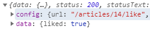

  <bR>

#### 2.1.4 좋아요 클릭 시 하트 색상 변경

- index.html \<script> 부분에 하트 색상 변경하는 if문 추가

  ``` javascript
  likeButtons.forEach(button => {
      button.addEventListener('click', function (event) {
        const articleId = event.target.dataset.id
        axios.get(`/articles/${articleId}/like`)
          .then(response => {
            if (response.data.liked) {
              event.target.style.color = 'crimson'
            }
            else{
              event.target.style.color = 'black'
            }
          }).catch(error => {
            console.log(error)
          })
      })
  })
  ```

- 실행 결과

  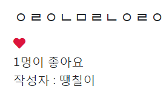

  <br>

### 2.2 좋아요 Count 비동기처리

- 좋아요를 누르고 새로고침을 해야 count 수가 변화함
- 바로 바로 적용되도록 바꿔보자!

#### 2.2.1 View

``` python
@login_required
def like(request, article_pk):
    ...
	context = {'liked':liked,
               'count':article.like_users.count(),}
```

<br>

#### 2.2.2 Templates

- 구분을 위해 span의 id를 지정

  ``` html
  <!-- _article.html -->
  ...
      <span id="like-count-{{article.pk}}">
        {{article.like_users.all|length}}
      </span>명이 좋아요
  ...
  ```

  <br>

- 알맞은 id 값을 가진 span 태그를 선택해서,

  사용자가 좋아요를 누를 때마다 response.data.count 값으로 갱신시킨다.

  ``` javascript
  // index.html
  likeButtons.forEach(button => {
      button.addEventListener('click', function (event) {
        // event.target.classList, event.target.dataset.id
        // 1. data-id에 article.pk가 들어있음 -> 동적 라우팅 활용
        const articleId = event.target.dataset.id
        // 2. 해당 게시글의 좋아요 요청 보내기
        axios.get(`/articles/${articleId}/like`)
          .then(response => {
            //3. 응답 결과 확인
            console.log(response.data)
            // 알맞은 id 값을 가진 span 태그를 선택해서,
            // 사용자가 좋아요를 누를 때마다 response.data.count 값으로 갱신시킨다.
            document.querySelector(`#like-count-${articleId}`).innerText = response.data.count
            if (response.data.liked) {
              event.target.style.color = 'crimson'
            } else {
              event.target.style.color = 'black'
            }
          }).catch(error => {
            console.log(error)
          })
      })
  ```

<br>

## 3. Like (POST 요청) 변경

- `axios.post(~)`

- url 마지막에 반드시 '/' 추가해야 함

- like 요청은 데이터베이스에 조작을 가하는 로직이기 때문에 GET 요청이 아니라 POST 요청이 적절함

  ``` javascript
  // article/index.html
  button.addEventListener('click', function (event) {
    const articleId = event.target.dataset.id
    axios.post(`/articles/${articleId}/like/`)
  // url 마지막에 반드시 '/' 추가해야 함
  ```

- **Forbidden Error**

  - 사용자 인증 필요

  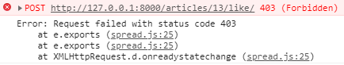

  - POST 요청 전에 default로 인증 값 설정

    - 지금 요청에선 Django Form을 통해 CSRF TOKEN을 넘겨줄 수 없으므로 Cookie에 담아서 직접 요청을 진행하자

    - django 사이트 : <https://docs.djangoproject.com/en/2.2/ref/csrf/#setting-the-token-on-the-ajax-request>

    ``` javascript
    axios.defaults.xsrfCookieName = 'csrftoken'
    axios.defaults.xsrfHeaderName = 'X-CSRFToken'
    axios.post(`/articles/${articleId}/like/`)
    ...
    ```

    <br>

### 3.1 `is_ajax()` 분기

- Ajax 요청일때만 like 수행하게 로직 변경

  아니면, 404 Error 발생시키기

  ``` python
  from django.http import JsonResponse, HttpResponseBadRequest
  
  @login_required
  def like(request, article_pk):
      if request.is_ajax():
          article = get_object_or_404(Article, pk= article_pk)
     		...
          return JsonResponse(context)
      else:
          return HttpResponseBadRequest
  ```

  <br>

- ajax는 XHR 객체를 통해 요청하고,  XHR 객체를 반환 받음

  - 현재는 XHR 객체가 없음

  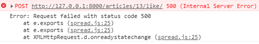

  <br>

- 지금은 Django가 들어온 요청이 Ajax 요청인지 구분할 방법이 없음

  요청을 보낼 때 XHR 객체를 담아서 함께 보내주자.

  ``` javascript
  // index.html
  ...
  button.addEventListener('click', function (event) { 
  // django가 Ajax 요청을 구분하게 하기 위해서 XHR 객체를 담아서 보내줌
  
    axios.defaults.headers.common['X-Requested-With'] = 'XMLHttpRequest'
  ```

<br>

### 3.2 회원만 좋아요 기능 사용할 수 있도록 수정

- 비회원이 좋아요를 누르면

  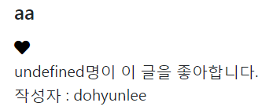

  한 문제점 발생!

  <br>

- 로그인 된 유저만 좋아요 기능 사용할 수 있도록 조건문 추가

  ``` javascript
  // article/index.html
  
      axios.post(`/articles/${articleId}/like/`)
        .then(response => {
          //3. 응답 결과 확인
          console.log(response.data)
          // 알맞은 id 값을 가진 span 태그를 선택해서,
          // 사용자가 좋아요를 누를 때마다 response.data.count 값으로 갱신시킨다.
          document.querySelector(`#like-count-${articleId}`).innerText = response.data.count
          if (response.data.liked) {
            event.target.style.color = 'crimson'
          } else {
            event.target.style.color = 'black'
          }
        }).catch(error => {
          console.log(error)
        })
    
      alert('로그인을 해야 기능을 사용할 수 있습니다.')
    
  ```
  <br>

- 실행 결과

  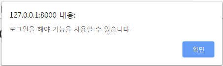

