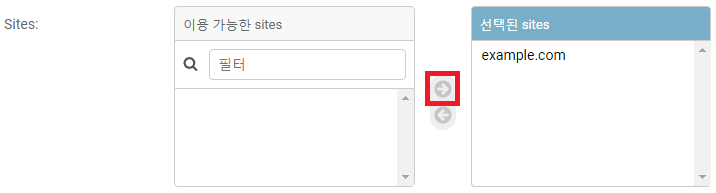

# 191125_django 배포하기

## 1. 새 Git Repo 생성

- 배포할 프로젝트 하나만 관리하고 있는 새로운 repository를 생성해야 함
  - 절대 다른 프로젝트가 있는 폴더로 진행하면 안 됨! 

#### 1.1 새 repo 생성

#### 1.2 .gitignore 등록

#### 1.3 원격 저장소 업로드

``` bash
$ git init
$ git add .
$ git commit -m "django 배포하기"
$ git remote add origin 
$ git push origin master
```

#### 1.4 패키지 설치

``` bash
// requirements.txt 생성
$ pip freeze > requirements.txt

// requirements.txt 설치
$ pip install -r requirements.txt
```

#### 1.5 환경변수 관리

``` bash
$ pip install python-decouple
```

- `config/settings.py` 안의 SECRET_KEY 관리
  
- 외부에 노출되면 안 됨
  
- root dir에 `.env` 파일 생성

  - git에 안 올라감

  ```
  SECRET_KEY='config/settings.py/SECRET_KEY 복사'
  DEBUG=True
  ```

- `config/settings.py` 수정

  ``` python
  from decouple import config
  ...
  SECRET_KEY = config('SECRET_KEY')
  DEBUG = config('DEBUG')
  ```

#### 1.6 django-heroku 패키지 설치

``` bash
$ pip install django-heroku
```

- `config/settings.py`맨 하단부에 추가

  ```python
  ...
  
  # heroku settings
  import django_heroku
  django_heroku.settings(locals())
  ```

### 2. 배포 설정

#### 2.1 Procfile

- 장고 프로젝트를 어느 ~를 이용해서 배포할 것인지 설정

- root dir에 `Procfile` 파일 생성

  ``` 
  web: gunicorn config.wsgi --log-file -
  ```

- 사용할 ~ 설치

  ``` bash
  $ pip install gunicorn
  ```

#### 2.2 파이썬 버전 명시

- root dir에 runtime.txt 생성

  ```
  python-3.7.4
  ```

#### 2.3 requirements.txt 업데이트

``` bash
$ pip freeze > requirements.txt
```

<br>

### 3. heroku 설치

- heroku cli : <https://devcenter.heroku.com/articles/heroku-cli>

- windows 64bit 다운로드


#### 3.1 heroku 로그인

``` bash
$ heroku login
```


#### 3.2 heroku 생성

``` bash
$ heroku create
$ git remote -v
```

​	

- 이제 첫 번째 주소로 push 해야 함

#### 3.3 환경변수 설정

- `.env` 파일에 있는 2개 변수 설정

  ``` bash
  $ heroku config:set DEBUG=True
  ```

  

  ``` bash
  $ heroku config:set SECRET_KEY='~'
  ```

  

- SECRET_KEY는 heroku 사이트에서 바꾸자

  - <https://dashboard.heroku.com>

  - 새로 만든 프로젝트 클릭

    

  - [Settings] 클릭

  

  - [Reveal Config Vars] 클릭

  

  - SECRET_KEY 등록

  


#### 3.4 heroku 서버로 push

- heroku에 Push

  ``` bash
  $ git add .
  $ git commit -m "설정파일 추가"
  $ git push heroku master
  ```


#### 3.5 heroku 서버에 mirate

``` bash
$ heroku run python manage.py makemigrations
```

- Error

  

  - 5000 번 port 막혀있는듯!

- heroku 사이트로 가잣

  - [More]-[Run console]


- `python manage.py makemigrations`

- `python manage.py migrate`

  

  

  

  

## 4. Social Login 주소 변경

- [일반] - [플랫폼] - [사이트 도메인]

  - heroku 도메인으로 변경
    - http://agile-bastion-22080.herokuapp.com 
    - https://agile-bastion-22080.herokuapp.com 

  

- [사용자관리] - [로그인 redirect url] 변경
  - heroku url로 변경
    - http://agile-bastion-22080.herokuapp.com/oauth
    - https://agile-bastion-22080.herokuapp.com/oauth
    - http://agile-bastion-22080.herokuapp.com/accounts/kakao/login/callback/


### 5. Django 관리 / admin


- 새 소셜 어플리케이션 추가

  

  - 클라이언트 아이디 : kakao developer - [설정] - [일반] - [앱 키] - [REST API 키]

  - 비밀 키 : kakao developer - [설정] - [고급] - [고급 설정] - [Client Secret] - [코드]

- Sites 선택

  

- 저장

  